# Jednosmerné a striedavé obvody
## Ohmov zákon, Kirchhoffové zákony
$U = R \cdot I$  
- Ak lineárnym rezistorom s odporom R preteká prúd I vytvorí sa na jeho svorkách úbytok napätia U  

$R = \frac{U}{I}$  
- Podiel napätia a prúdu je veličina stála a nazýva sa elektrický odpor  

$I = \frac{U}{R}$
- Prúd, ktorý preteká lineárnym rezistorom je priamo úmerný napätiu na jeho svorkách a nepriamo úmerný jeho veľkosti  

**VACH(volt ampérová charakteristika)** - grafické znázornenie ohmovho zákona
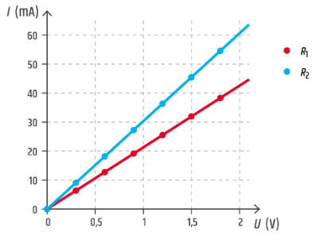

## Kirchhoffove zákony
### 1. Kirchhoffov zákon
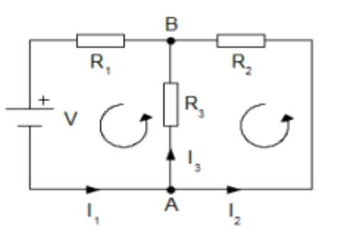
- o prúdoch a uzloch
<table>
  <tr>
    <th>1. KZ pre uzol A</th>
    <th>1. KZ pre uzol B</th>
  </tr>
  <tr>
    <td>I1 = I2 + I3</td>
    <td>0 = I1 - I2 - I3</td>
  </tr>
  <tr>
    <td>I1 = I2 + I3</td>
    <td>0 = I2 + I3- I1</td>
  </tr>
</table>
        Súčet prúdov do uzla vtekajúcich sa rovná súčtu prúdu z uzla vytekajúcich (druhé znenie: algebrický súčet prúdov v uzle sa rovná nule)

### 2.Kirchhoffov zákon
- o napätiach a slučkách
<table>
      <tr>
        <td>V uzavretej slučke je súčet napätí rovné nule</td>
        <td>0 = UR1 + UR3 - U</td>
      </tr>
      <tr>
        <td>Súčet úbytkov napätí je rovné napätí na zdroji</th>
        <td>U = UR1 + UR3</td>
      </tr>
</table>

## Výpočet sériového, paralelného a kombinovaného zapojenia s rezistormi

### 1. Sériové zapojenie

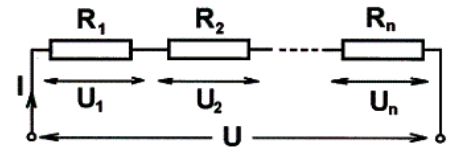

$U = U1 + U2 + U3$

$R*I = R1*I + R2*I + R3*I$

$R = R1 + R2 + R3$

**Dôležité:**
- V celej vetve je prúd rovnaký
- Výsledné napätie sa rovná súčtu napätí na jednotlivých odporoch
- Výsledný odpor sa rovná súčtu jednotlivých odporov
- Výsledný odpor je vždy väčší ako hociktorý z odporov
- Napätie sa rozdelí na jednotlivé odpory v priamom pomere k odporom

### 2. **Paralelne zapojenie**

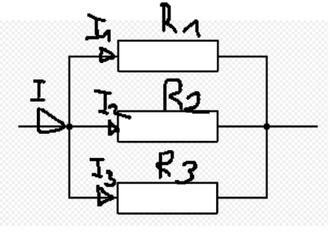

$I = I1 + I2 + I3$  

$\frac{U}{R} = \frac{U}{R_{1}} + \frac{U}{R_{2}} + \frac{U}{R_{3}}$

$\frac{1}{R} = \frac{1}{R_{1}} + \frac{1}{R_{2}} + \frac{1}{R_{3}}$

**Dôležité:**
- Na všetkých paralelných vetvách je rovnaké napätie
- Výsledný prúd sa rovná súčtu prúdov cez jednotlivé rezistory
- Prevrátená hodnota výsledného odporu sa rovná súčtu prevrátených hodnôt jednotlivých odporov
- Prúdy vo vetvách sa rozdelia v nepriamom pomere k odporom(cez väčší odpor menší prúd)
- Výsledný odpor je menší ako odpor ktorejkoľvek vetvy
- Keď je n rovnakých odporov R1 paralelne, tak R = R1/n

### 3. Sériovo paralelne

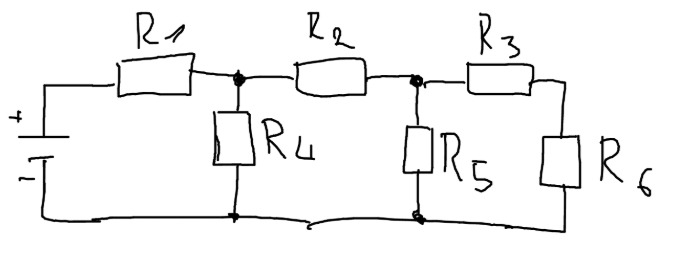

| $R_1$ | $R_2$ | $R_3$ | $R_4$ | $R_5$ | $R_6$ | 
|-------|-------|-------|-------|-------|-------|
|  10 Ω |   7 Ω |   2 Ω |  10 Ω |   6 Ω |   4 Ω |

|                        |  Výpočet  | Výsledok |
|------------------------|-----------|----------|
| **R₃₆** (Sériovo)      | $R_{36} = R_3 + R_6$ $R_{36} = 2 + 4$ | $R_{36} = 6 Ω$ |
| **R₃₅₆** (Paralerne)   | $R_{356} = \frac{R_5 × R_{36}}{R_5 + R_{36}}$ $R_{356} = \frac{6 × 6}{6 + 6}$ | $R_{356} = 3 Ω$ |
| **R₂₃₅₆** (Sériovo)    | $R_{2356} = R_2 + R_{356}$ $R_{2356} = 7 + 3$ | $R_{2356} = 10 Ω$ |
| **R₂₃₄₅₆** (Paralerne) | $R_{23456} = \frac{R_{2356} × R_4}{R_{2356} + R_4}$ $R_{23456} = \frac{10 × 10}{10 + 10}$ | $R_{23456} = 5 Ω$ |
| **R₁₋₆** (Dokopy)      | $R_{1-6} = R_1 + R_{23456}$ $R_{1-6} = 10 + 5$ | $R_{1-6} = 15 Ω$ |

## Rezistor, označenie a zhotovenie
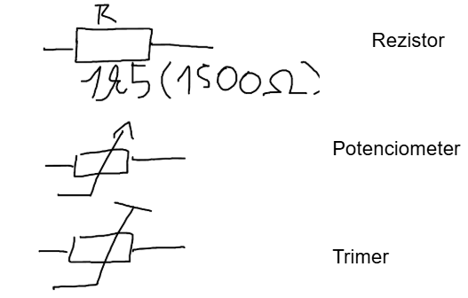

__Potenciometer__ - nastaviteľný rezistor, prístupný pre zmenu(odporu) na zariadení(zvonu) -- otáčací gombík  

__Trimer__ - nastaviteľný rezistor, dostupný k zmene len dnu v zariadení(nedá sa zmeniť z vonku)  

**Označovanie rezistorov:**  
a) Farebný kód(prúžky) 
- Farebné prúžky na tele rezistoru  

b) Číselné označovanie 
- Čísla na tele rezistoru (4k5 = 4500Ω, 5M2 = 5 200 000Ω, 4R7 = 4,7Ω)  

**Zhotovenie rezistorov:**  
*Drôtové(vinuté)* -- drôt navinutý na keramické teliesko  
*Vrstvové* -- odporová vrstva sa nanesie(naparí) na (keramické)jadro (uhlíkový, metaloxidový)  
*Materiálové(SMD)* -- 2 vodivé plôšky  

**Typové rady(normy):**  
E6 -- tolerancia ± 20%  
E12 -- tolerancia ± 10%  
E24 -- tolerancia ± 5%  
$R = \rho*\frac{l}{S}$

## Výpočet C a L z fyzických rozmerov súčiastok
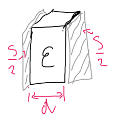

$$C = \varepsilon_{0} \cdot \varepsilon_{r} \cdot \frac{S}{d}\ \lbrack F\rbrack$$

$ε_0$ = permitivita vákua (8,854*10^-12^ F/m)  
$ε_r$ = relatívna permitivita materiálu  
S = plocha dosiek kondenzátora  
d = vzdialenosť medzi dielektrikami(priemer dielektrika)  

$$L = N² * μ * S / l \ [H]$$

N = počet závitov cievky  
μ(mí) = magnetická priepustnosť jadra (permeabilita prostredia H/m)  
S = prierez cievky  
l = dĺžka cievky  

## Elektrostatické(elektrické) a magnetické pole

### 1. Elektrostatické pole
Je to pole statických nábojov -- Q[C] C- coulomb(jednotka veličiny)  

[Coulombov zákon]{.underline} -- vyjadruje veľkosť akou na seba pôsobia 2 statické náboje Q1, Q2 v rôznom prostredí ε, vo vzdialenosti r  

$$F = \frac{1}{4\pi\varepsilon} \cdot \frac{Q_1 \cdot Q_2}{r^2}$$
$ε = ε_0 * ε_r$  
$Q_1, Q_2$ -> veľkosť nábojov  
r -> vzdialenosť medzi nábojmi  

#### Intenzita elektrostatického poľa

$$E = \frac{F}{Q}\ldots.\left\lbrack \frac{N}{C} \right\rbrack\ \ \ \ \ \ \ \ \ \ \ \ \ \ E = \frac{U}{d}\ldots\ldots.\left\lbrack \frac{V}{m} \right\rbrack$$

- Vektorová veličina -> má veľkosť, smer, pôsobisko
- Znázornenie intenzity -> siločiary  

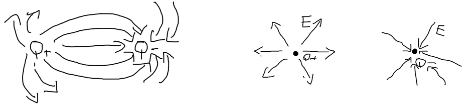

$E1 = \frac{1}{4\pi\varepsilon}\ .\frac{Q_1}{r_1}\ $  
$E2 = \frac{1}{4\pi\varepsilon}\ .\frac{Q_2}{r_2}\ $  
$E = E1 + E2$ - intenzita v danom mieste  

#### Elektrická indukcia

$$D = \frac{Q}{S}\ldots.\left\lbrack \frac{C}{m²} \right\rbrack$$

- Náboj, ktorý sa indukuje, nahromadí na jednotkovej ploche vodiča, vloženého do vonkajšieho elektrostatického poľa  
- Množstvo naindukovaného náboja závisí od polohy vodiča v poli  
- Ak je vodič otočený pod uhlom 90º → D= 0 → D = Q/S * cos α( cos 90 = 0)  

### 2. Magnetické pole
Jeho vznik spôsobuje pohyb elektrónov  
permanentný magnet -- pohybujúci sa elektrón, prúdovodič -- pohybujúci sa elektrón  
Druhy magnetických látok -- feromagnetické, diamagnetické, paramagnetické  

#### Magnetické napätie - *Um[A]*
Je vyvolávané prúdom  

Um pre jeden vodič → $Um = I$  
Um pre viac vodičov → $Um = I1 + I2 + ... In$  
Um pre cievku → Um = N * I (N- počet závitov cievky)  

#### Intenzita magnetického poľa - *H*  
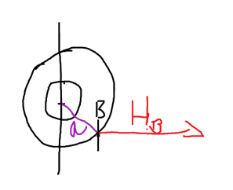

$H = \frac{Um}{l}\ldots.\left\lbrack \frac{A}{m} \right\rbrack$, $H = \frac{B}{µ}$  
$H_b = \frac{I}{2\pi*a}$  
- Dotyčnica k siločiare v smere siločiary  
- Intenzita v smere siločiary  

#### Magnetická indukcia - *B*  
$B = \frac{\varphi}{S}\ \ \ \ \ \ \ \ \ \ \ \ \ B = µ*H\ $ 

$\phi$(fí) - magnetický tok [Wb] .. Weber, je to tok cez plochu = počet siločiar  
S - plocha [$m^2$]  
B - indukcia [T] .. Tesla, hustota siločiar cez určitú plochu  
$\mu$(mí) - permeabilita magnetickej látky ($µ_0 = 4π * 10^{-7} H/m$)  

#### Vzťah medzi intenzitou a indukciou
**Hysterézna slučka**
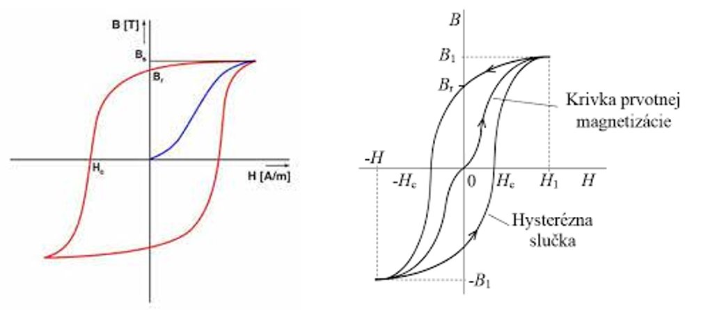
$H_C$ - koercitívna sila = hodnota vonkajšieho magnetického poľa, ktorým z látky odstránim zvyškový magnetizmus  
$B_r$ - remanentný (zvyškový) magnetizmus, je pri ňom vonkajšie pole = 0 (nepôsobí prúd)  
Čím je slučka väčšia, tým sa materiál ťažšie zmagnetizuje  

Magnetický tok Φ → $\Phi = \frac{Um}{Rm}$  
Magnetický odpor Rm → $Rm = \frac{Um}{\varphi}$  
$Rm = \frac{1}{\mu}*\ \frac{l}{S}$ Rm[H^-1^]  
Magnetická vodivosť Gm = $Gm = \frac{1}{Rm}\ \lbrack H\rbrack$  

## Porovnanie veličín elektrostatického a magnetického poľa
| | | |
| -------- | ------- | ------- |
| Elektrostatická Intenzita | <=> | Magnetická Intenzita | 
| Elektrická Indukcia       | <=> | Magnetická Indukcia  | 

## Vlastnosti R,L,C v striedavých obvodoch

### 1. R (Odpor)
- Napätie a prú sú vo fáze(ak I = 0, tak U = 0), φ(fí) = 0  
- Odpor je frekvenčne nezávislý  

$$u_{R} = U_{m} \cdot \sin\omega \cdot t$$  
$$i = I_{m} \cdot \sin\omega \cdot t$$  
$$R = \frac{u}{i}\ \ = \ \ \frac{Uef}{Ief}$$  
$u, i$ - okamžitá hodnota  
$I_m, U_m$ - maximálna hodnota  
$U_{ef}, I_{ef}$ - efektívna hodnota Ief = Imax / √2  
$\omega$(omega) - uhlová rýchlosť → Ѡ = 2 * π * f  
$t$ - čas  

### 2. L (Cievka)
- u~L~ a i sú posunuté o 90º, u~L~ predbieha prúd(cievka posúva napätie o 90º dopredu)  
- napätie je Um vtedy, keď prúd je 0  
- X~L~ je frekvenčne závislý, so stúpajúcou frekvenciou stúpa odpor  

$$u_{L} = U_{m} \cdot {sin(}\omega \cdot t + \ 90)$$  
$$i = I_{m} \cdot \sin\omega \cdot t$$  
$$X_L = \omega * L = 2 * π * f * L $$ 

$L$ - indukčnosť cievky  
$X_L$ - zdanlivý odpor cievky v striedavom obvode → indukčná reaktancia  

### 3. C (Kapacita)
- u a i sú posunuté o 90°, $i_C$ predbieha napätie (kondenzátor posúva prúd o 90° dopredu)  
- $XC$ je frekvenčne závislý, so stúpajúcou frekvenciou klesá odpor  

$$u = U_{m} \cdot {sin}\omega \cdot t$$  
$$i = I_{m} \cdot \sin{(\omega} \cdot t + \ 90{^\circ})$$  
$$X_{C} = \frac{1}{2\pi f \cdot C}$$  

$C$ - kapacita kondenzátora  
$X_L$ - zdanlivý odpor kondenzátora v striedavom obvode → kapacitná reaktancia
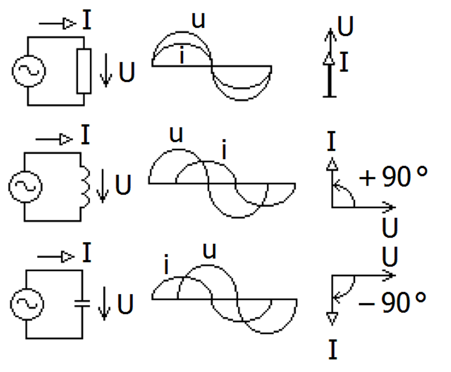  

## Rezonančné obvody (Z,Y,X cievky a kondenzátora)

### 1. Sériový RLC
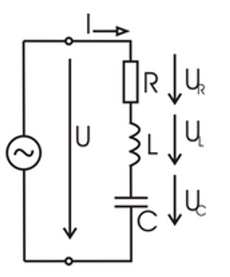  

$$u = u_R + u_L + u_C$$  
$$Z = \sqrt{R^{2} + \left( X_{L} - X_{C} \right)^{2}} [Ω] $$ 

Z - impedancia obvodu, odpor striedavého obvodu  
Indukčný charakter → $X_L > X_C$  
Kapacitný charakter → $X_C > X_L$  

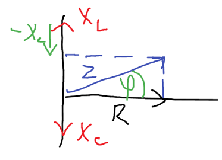

cos φ(fí) = $\frac{R}{Z}$  
sin φ(fí) = $\frac{XL\ - \ XC}{Z}$

__Stav rezonancie__  
$X_L = X_C$ → $Z = \sqrt{R^{2} + (0)^{2}}$ → $Z = \sqrt{R^{2}}$ → $Z = R$  
Rezonančná frekvencia → $f_{0} = \frac{1}{2\pi\sqrt{LC}}$  
V stave rezonancie je najvyšší prú a najnižší odpor  

### 2. **Paralelný RLC**  

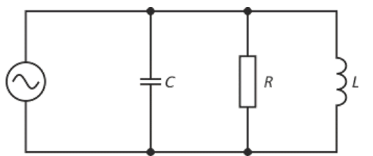

$$Y = \frac{1}{Z}$$  
Y - Admitancia [S]  

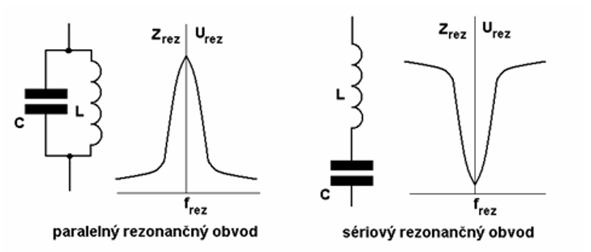

## Okamžitá, maximálna, efektívna hodnota striedavého U a I

### 1. Okamžitá  
Je to hodnota v konkrétnom čase  

$$u = U_{m} \cdot \sin\omega \cdot t$$  
$$i = I_{m} \cdot \sin\omega \cdot t$$  

$\omega$ (omega) - uhlová rýchlosť → $\omega = 2 * π * f$  
t → čas  
u , i → okamžitá hodnota  

### 2. Maximálna  
Je to najväčšia výchylka okamžitej hodnoty od 0 → najväčšia hodnota U, I  

$$U_{\max} = U_{ef} \cdot \sqrt{2}$$  
$$I_{\max} = I_{ef} \cdot \sqrt{2}$$  

### 3. Efektívna
Hodnota, ktorá má rovnaké tepelné účinky ako jednosmerný prúd  

$$U_{ef} = \frac{U_{\max}}{\sqrt{2}}$$  
$$I_{ef} = \frac{I_{\max}}{\sqrt{2}}$$  

# Polovodičové súčiastky
## Fyzikálna podstata polovodiča
Sú to materiály, ktoré majú vlastnosti medzi vodičmi a izolantmi. Sú to prvky z 4 skupiny periodickej tabuľky.  
**Princíp:** V čistom vstave má 4 elektróny na valenčnej vrstve, ktoré vytvárajú kovalentné väzby s atómami. Pri vyššej teplote alebo osvietení sa elektróny môžu z väzieb oddeliť. Voľné elektróny sa môžu pohybovať(vedia elektrický prúd), po ich oddelení vzniká dierka.  

## Vlastná a nevlastná vodivosť polovodiča typu P, N

### 1. Vlastná vodivosť
Polovodič bez prídavných atómov, vodivosť vzniká iba pôsobením tepla alebo svetla  
Pri uvoľnení elektrónu vzniká dierka, množstvo dier a elektrónov je rovnaké  

### 2. Nevlastná vodivosť  
Dosahuje sa dopovaním → pridaním malého množstva cudzích atómov, ktoré zmenia počet elektrónov  

### Polovodič typu N:  
Medzi atómy zo 4 skupiny je primiešaný prvok z 5 skupiny  
4 elektróny vytvoria väzbu a ostáva 1 elektrón naviac. Elektróny sú hlavné(majoritné) nosiče náboja a dierky minoritné  

### Polovodič typu P:
Medzi atómy zo 4 skupiny je primiešaný prvok z 3 skupiny  
Na vytvorenie väzby chýba 1 elektrón → vzniká dierka. Dierky sú hlavné nosiče náboja a elektróny minoritné  

## Polovodičová dióda -- funkcia, charakteristika

Je to elektronická súčiastka, ktorá prepúšťa prúd iba v jednom smere  

Tvorí ju PN priechod → je to spojenie polovodiču typu P a N, elektróny a dierky sa navzájom zrušia a vznikne oblasť bez voľných elektrónov(hradlová vrstva). Pri kladnom napätí prechádza prúd a pri zápornom neprechádza.  

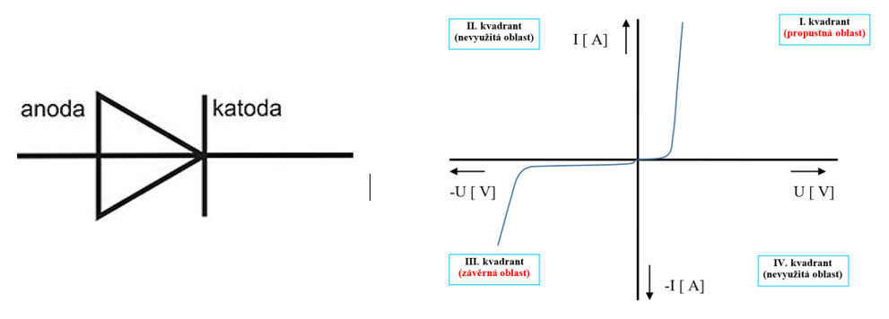

Môže byť zapojená v priepustnom a závernom smere  

### Priepustný: 
Anóda je pripojená na kladný pól a katóda na záporný  
Prúd začne výrazne tiecť po prekročení prahového napätie(0,7V pre kremík)  

### Záverný:  
Anóda je pripojená na záporný pól a katóda na kladný  
Prúd netečie. Pri príliš veľkom napätí vie dôjsť k prerazeniu diódy a jej poškodeniu  

**Použitie diódy**: usmerňovače, stabilizátory  

## Špeciálne diódy, Zenerová dióda, Varikap

### 1. Zenerová dióda
Zapája sa v závernom smere, pri určitom napätí(zenerové napätie) začne viesť prúd v závernom smere bez zničenia. V priepustnom smere sa správa ako klasická dióda  
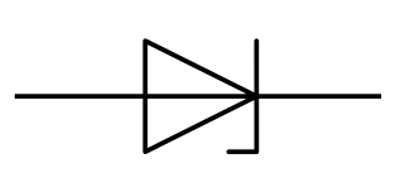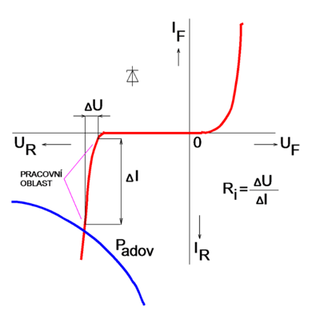  

Využíva sa na stabilizáciu napätia a aj ako ochrana pred prepätím  

### 2. Varikap  
Mení svoju kapacitu v závislosti od napätia v závernej polarizácií. Pri závernom napätí sa zväčší PN priechod a tým sa mení kapacita → čím väčšie U tým je menšia kapacita.  

Využíva sa v laditeľných rádiových obvodoch, mobiloch, televízoroch  
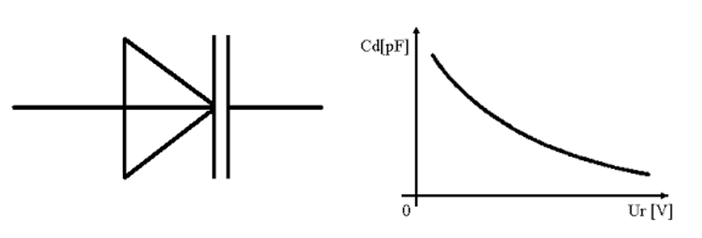 

## Tranzistory 
- bipolárne, unipolárne, porovnanie, značka, VACH, hybridné parametre
Delíme ich na:  
- Bipolárne → PNP, NPN  
- Unipolárne → FET, JFET, MISFET, MOSFET  

Je to aktívny zosilňovací prvok, zložený z polovodičov, PN priechody  

Použitie: zosilňovač, spínač  

### 1. Bipolárne  
Tranzistor skladá sa z 2 PN priechodov(3 polovodiče), ktoré musia byť polarizované:  
- Emitor, báza v priepustnom smere  
- Kolektor, báza v závernom smere  

Malým bázovým prúdom ovplyvňujeme(regulujeme) veľký prúd na emitore  
Na vedení prúdu sa využívajú obidva druhy nosičov náboja(elektróny, dierky)  

NPN - hlavným nosičom náboja sú elektróny  
PNP - hlavným nosičom náboja sú dierky  

Použitie - zosilňovač(externé napájanie), spínač, logické funkcie -- 0, 1  
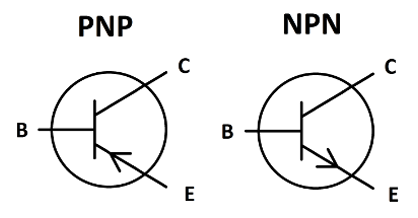 
 

#### Zapojenia:
   1. Spoločný Emitor  
      - Malý vstupný odpor, relatívne veľký výstupný odpor  
      - Veľké prúdové, napäťové, výkonové zosilnenie  
   2. Spoločný kolektor(emitorový sledovač)  
      - Veľký vstupný odpor, malý výstupný  
      - Malé napäťové, výkonové zosilnenie, veľké prúdové zosilnenie  
   3. Spoločná báza  
      - Malý vstupný odpor, veľký výstupný odpor  
      - Použitie na reguláciu napätia  

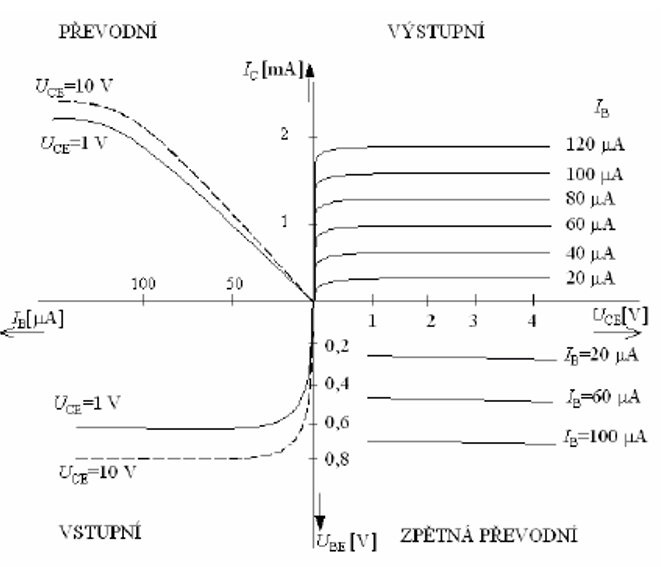

#### Hybridné parametre:  
$H_{11} = ΔU_{BE} / ΔI_{BE}$ - vstupný dynamický odpor  
$H_{21} = ΔI_{C} / ΔI_{B}$ - prúdový zosilňovací činiteľ  
$H_{12} = ΔU_{BE} / ΔU_{CE}$ - napäťové zosilnenie v spätnom smere  
$H_{22} = ΔI_{C} / ΔU_{CE}$ - výstupná vodivosť  

### 2. Unipolárne ([link](https://www.kis.fri.uniza.sk/~ludo/e-Publikacia/elektronika/kap3/index.html))  
Na vedení prúdu sa zúčastňujú iba nosiče náboja jednej polarity( dierky alebo elektróny)  
Má Kolektor, Emitor, Gate  

FET = field efect tranzistor (pólom riadený tranzistor)  

#### 1. JFET  
JFET -- junction FET  

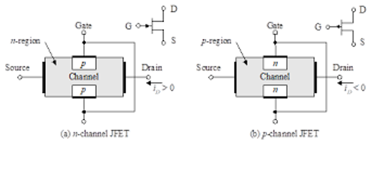  
Princíp funkčnosti: medzi hradlom a kanálom je vytvorený PN priechod, ktorý sa polarizuje v závernom smere  
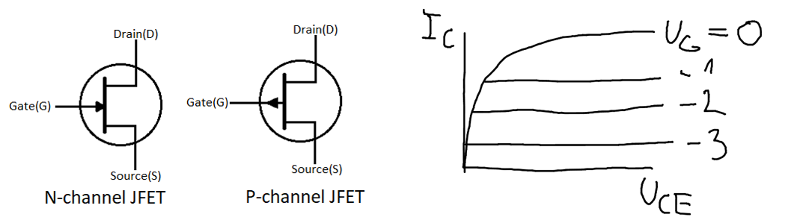

#### 2. MISFET 
MISFET -- metal insulator semiconductor FET  
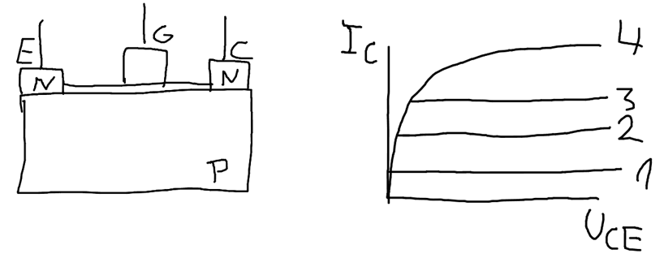

#### 3. MOSFET  
Zo zabudovaným kanálom: 
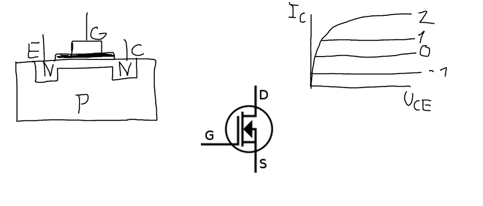

S indukovaným kanálom:  
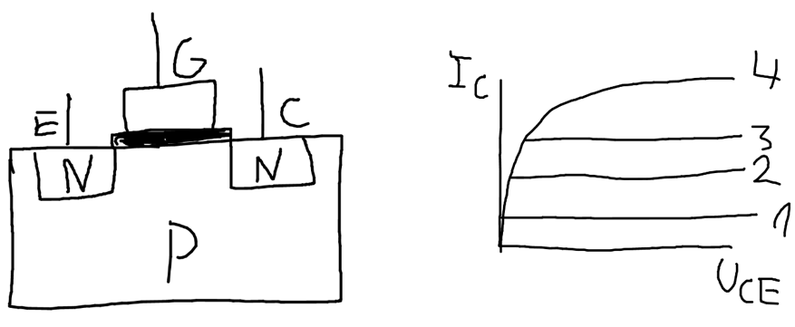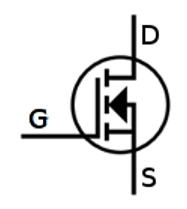

{width="1.4064457567804025in" height="1.5002088801399824in"}  

#### _Porovnanie_
| Bipolárne                           |   <=>   | Unipolárne                              | 
| ----------------------------------- | ------- | --------------------------------------- |
| prúdovo riadený(báza)               |         | riadené napätím(gate)                   | 
| elektróny aj dierky(vedenie Q)      |         | buď elektróny alebo dierky(vedenie Q)   | 
| pomalší, viac sa zahrieva           |         | rýchlejší, menšie zahrievanie           | 
| odolnejší proti statickej elektrine |         | citlivý na statickú elektrinu           | 

# Číslicová technika
## Kombinačné a sekvenčné obvody, porovnanie
### 1. Kombinačné Logické obvody(KLO)
Sú také logické obvody, ktorých stav výstupov je jednoznačne daný stavom ich aktuálnych vstupov, teda v každom čase je možné priradiť akékoľvek kombinácie vstupov vždy tú istú príslušnú kombináciu výstupov.  

_ozdelenie KLO:_  
   1. **Jednoduché KLO** - hradlá  
   Slúžia na realizáciu základných logických operácií → NOT, AND, NAND, OR, NOR, XOR, XNOR, AND OR INVERT  
   2. **Zložité KLO** - aritmetické jednotky  
   Slúžia na realizáciu zložitých aritmetických logických operácií → sčítačka, násobička, mutiplexor, demultiplexor, prepínač, komparátor, kóder, dekóder, generátor parity, aritmeticko-logická jednotka  

### 2. Sekvenčné Logické obvody(SLO)  
Ich vstupné premenné sú určené nie len kombináciou hodnôt v danom okamihu ale aj minulými hodnotami niektorých premenných, z toho vyplýva, že SLO si musí pamätať hodnoty z predchádzajúceho stavu, čo znamená, že musí mať pamäť.  

Základom SO sú klopné obvody, z ktorých sa konštrujú ďalej tzv. čítače, registre, pamäťové obvody  

Máme preklápacie obvody → RS, SL, D, JK, T  
Zložitejšie → Čítače, pamäťové registre  

**Porovnanie:**  
| KLO                    |   <=>   | SLO                             | 
| ---------------------- | ------- | ------------------------------- |
| Nemá pamäť             |         | Má pamäť                        | 
| Bez synchronizácie     |         | Synchronizácia -- clock rate    |
| Okamžitá odozva        |         | Oneskorená odozva               |
| Výstup podľakt. hodnôt |         |  Výstup akt hodnoty + predchádzajúce |

## Logické obvody

### Hradlo AND (logický súčin A*B)
Jeho výstup je logickým súčinom všetkých jeho vstupov  
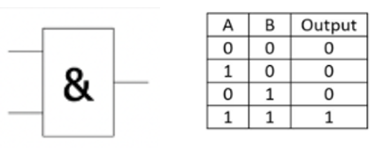

### Hradlo OR (logický súčet A+B)
Jeho výstupom je súčet všetkých jeho vstupov  
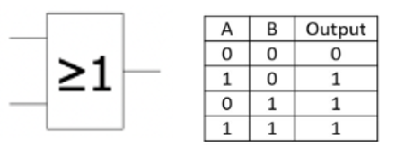

### Hradlo NOT (negácia)
Jeho výstup je negáciou jeho vstupu, nazýva sa logický invertor  
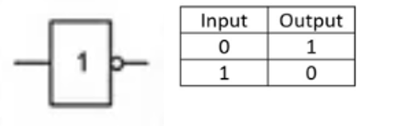

### Hradlo NAND (negovaný logický súčin) 
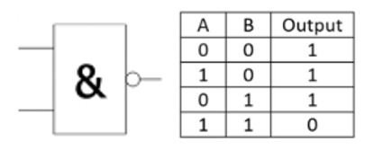

### Hradlo NOR (negovaný logický súčet)
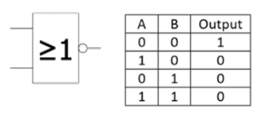

---

--- TUNING END --- 

---

## Multiplexor a demultiplexor, komparátor, sčítačka

1. **Multiplexor**  
Je to zložitý KLO, ktorý prevádza paralelný binárny signál na sériový binárny signál  

Má N adresových vstupov, maximálne však 2^N^ dátových vstupov a jeden výstup Q  

Umožňuje preniesť informáciu z niektorého z N adresových vstupov do výstupu, pričom stav výstupu je zhodný zo stavom vybraného vstupu  

{width="1.7708333333333333in" height="2.4493055555555556in"}  
{width="2.847916666666667in" height="3.125in"}  

[schéma](https://www.watelectronics.com/wp-content/uploads/multiplexer.jpg)  

**2. Demultiplexor**  
Je to zložitý KLO, prevádza sériový binárny signál na paralelný binárny signál  

{width="2.502369860017498in" height="3.5104166666666665in"}  
Umožňuje preniesť informáciu z jedného vstupu na niektorý z N výstupov  

{width="2.3125in" height="2.9583333333333335in"}  

[schéma](https://www.google.com/url?sa=i&url=https%3A%2F%2Fencyklopediapoznania.sk%2Fclanok%2F9544%2Fmultiplexor-multiplexer-demultiplexor-demultiplexer&psig=AOvVaw09e5lXx_EtfNgs7nDpPo0M&ust=1745339573160000&source=images&cd=vfe&opi=89978449&ved=0CBQQjRxqFwoTCKiRotzG6YwDFQAAAAAdAAAAABAE)  

3. **Komparátor**  
Je to KLO, ktorý porovnáva vstupy / porovnáva 2 vstupy a určuje, či je jedno číslo väčšie, menšie alebo rovné druhému  

| A | B | A = B | A > B | A < B |
|---|---|-------|-------|-------|
| 0 | 0 | 1     | 0     | 0     |
| 0 | 1 | 0     | 0     | 1     |
| 1 | 0 | 0     | 1     | 0     |
| 1 | 1 | 1     | 0     | 0     |

4. **Sčítačka**  
Umožňuje sčítanie 2 čísel A,B reprezentovaných v binárnej sústave  

Sčítačky môžu byť 1 bitové(polovičná, úplná), viacbitové(s propagáciou prenosu, s predikciou prenosu)  

{width="6.352777777777778in" height="2.5069444444444446in"}  
[Neúplná 1 bitová]{.underline}  

{width="1.1284722222222223in" height="1.488888888888889in"}  

{width="1.6694444444444445in" height="2.9270833333333335in"}  
[Úplná 1 bitová]{.underline}  

{width="5.635416666666667in" height="1.6111111111111112in"}  
umožňuje sčítať 2 jednobitové čísla s pripočítaním prenosu z predchádzajúceho rádu  

[Viacbitová s propagáciou prenosu]{.underline}  

{width="6.3in" height="1.9715277777777778in"}  
Je zostavená z N úplných jednobitových sčítačiek ich zreťazením  

Vstupom sú 2 N-bitové čísla a výstupom N-bitový súčet a jednobitový prenos  

Výhody → jednoduchý návrh a realizácie, rozšíriteľnosť  
Nevýhody → oneskorenie pri dlhý číslach, sčítačka musí čakať na prenos od predchádzajúcej sčítačky  

{width="5.819620516185477in" height="3.286111111111111in"}  
[Viacbitová s predikciou prenosu]{.underline}  

Je zostavená z N úplných jednobitových sčítačiek ich zreťazením  
Jednotkou predikcie je Carry Lookahead Logic -- vypočítava všetky prenosy súčasne  

Výhody → vypočítať prenos rýchlo  
Nevýhody → vyššie nároky na počet hradiel, realizovateľná len do určitého počtu  

## Základné sekvenčné obvody -- RS, JK, T, D

1. **RS**  
Najjednoduchší preklápací obvod  

{width="2.9479166666666665in" height="2.4993055555555554in"}  
{width="4.5006277340332455in" height="2.239896106736658in"}  
Asynchrónny -- bez clock ratu  
Synchrónny -- s hodinovým impulzom  

{width="2.864983595800525in" height="1.5522998687664042in"}  

| S | R | Qn+1       | 
|---|---|------------|
| 0 | 0 | Qn         | Zachovanie stavu |
| 0 | 1 | 0          | Nulovanie |
| 1 | 0 | 1          | Nastavenie |
| 1 | 1 | ?          | Zakázaný stav |

2. **JK**  
{width="2.5833333333333335in" height="1.7739982502187226in"}  
{width="3.8020833333333335in" height="1.8333333333333333in"}  
Je základným synchrónnym preklápacím obvodom  

| J | K | C | Qn+1(výstup)       | 
|---|---|---|--------------------|
| x | x | 0 | Qn                 | Zachovanie stavu |
| 0 | 0 | 1 | Qn                 | Zachovanie stavu |
| 0 | 1 | 1 | 0                  | Nulovanie |
| 1 | 0 | 1 | 1                  | Nastavenie |
| 1 | 1 | 1 | Qn'                | Negovanie stavu |

3. **T**  
Je to asynchrónny preklápací obvod, môže byť synchrónny ak pridáme hodinový impulz  

{width="1.8298611111111112in" height="1.1354166666666667in"}  
Je ho možné vyrobiť z obvodu JK spojením všetkých jeho vstupov do jedného  

{width="1.5416666666666667in" height="1.2708333333333333in"}  

> {width="3.4784722222222224in" height="2.2083333333333335in"}  

{width="2.5625in" height="2.4006944444444445in"}  
Asynchrónny  
Synchrónny  

| T | Qn | Qn+1          | 
|---|---|---------------|
| 0 | 0  | Qn            | Zach. Stavu |
| 0 | 1  | Qn            | Zach. stavu |
| 1 | 0  | 1             | Negovanie |
| 1 | 1  | 0             | negovanie |

4. {width="4.5in" height="1.6625in"}  
**D**  

{width="1.9673611111111111in" height="1.5in"}  

Odstraňuje zakázaný stav prepojením obidvoch vstupov klopného obvodu RS invertorom. Obvod je riadený hodinovým vstupom → preklopí len v priebehu hodinového impulzu. Invertor zaisťuje že vstupy budú rozdielne.  

# Sieťové napájacie zdroje

## Bloková schéma lineárneho napájacieho zdroja

{width="7.260416666666667in" height="2.109722222222222in"}  

**Transformátor** -- pracuje na princípe elektro-magnetickej indukcie  
Mení veľkosť napätia bez zmeny frekvencie  
Transformačný pomer → $p = \frac{N2}{N1} = \frac{U2}{U1}$  

**Usmerňovač** -- premieňa striedavé napätie na jednosmerné  

{width="4.104166666666667in" height="2.535416666666667in"}  
Môže byť -- jednocestný, dvojcestný(2diódy, 4diódy- mostíkové zapojenie)  

{width="3.3895833333333334in" height="1.4270833333333333in"}  

{width="3.9895833333333335in" height="2.2379899387576554in"}  

Činiteľ zvlnenia φ~zv~(fí)  
$$\varphi zv = \frac{Uzv}{Uo}*100\%$$  

Uzv -- stried. zložka za usmerňovačom  
Uo -- jednosmerná za usmerňovačom  

**Filter** -- odfiltrovanie nežiadúcich frekvencií, vyhladenie výstupného napätia  
Sú aktívne(tranzistory) a pasívne(RC, LC filter) filtre  

Činiteľ vyhladenia -- φ~v~  
$\varphi_{v} = \frac{\Delta U_{1}}{\Delta U_{2}} = \frac{U_{zv1}}{U_{zv2}}$  

{width="1.5729166666666667in" height="2.4972222222222222in"}  
ΔU~1~ = U~zv1~ → striedava zložka na vstupe  
ΔU~2~ = U~zv2~ → striedava zložka na výstupe  

Kondenzátor pre striedavý prúd malý odpor → pôjde cez neho  
Cievka predstavuje odpor pre striedavý prúd, pre jednosmerný nepredstavuje → prejde hlavne jednosmerný prúd  

**Stabilizátor** -- zdroje musia na výstupe udržovať stabilné napätie  
Činiteľ stabilizácie  
$\varphi_{st} = \frac{\Delta U_{1}}{\Delta U_{2}}*\frac{U_{2}}{U_{1}}$ >js , U2 = U1, ΔU1 / Δ U2 > 0  

{width="4.269444444444445in" height="2.2291666666666665in"}  
{width="2.8958333333333335in" height="2.8020833333333335in"}  
Môže byť parametrický(Zenerová dióda) a spätnovezbové  

## Bloková schéma impulzne regulovaného zdroja

{width="5.406944444444444in" height="1.2083333333333333in"}  

{width="2.4368055555555554in" height="1.7083333333333333in"}  

# Filtre

## Horná a dolná priepusť, princíp a použitie

Medzná frekvencia f~m~ → $f_{m} = \frac{1}{2\pi\tau}$  
Tau - τ je to časová konštanta, definuje sa podľa použitých súčiastok  
$\tau = R*C$  
$\tau = \frac{L}{R}$  

1. **Dolná pripusť**  
- Integračný článok RC, LR  
Prepúšťa dolné(nízke frekvencie), a vysoké tlmí. Hranica tlmenia je medzná frekvencia f~m~ pri ktorej je napäťový prenos okolo 70%, alebo útlm -3db  

2. **Horná priepusť**  
- Derivačný článok CR, RL  
Prepúšťa horné(vysoké) a nízke tlmí. Hranica tlmenia je medzná frekvencia  

{width="4.415277777777778in" height="0.6666666666666666in"}  

{width="3.8493055555555555in" height="5.145833333333333in"}  

Využitie HP, DP  
- Filtre  
Filtrácia a prepúšťanie frekvencií  

## Realizácia pomocou prvkov R,C a R,L, prenos v db(útlm)

1. {width="5.558333333333334in" height="2.3958333333333335in"}  
**DP**  

{width="5.145833333333333in" height="2.9166666666666665in"}  

2. {width="2.4270833333333335in" height="1.675in"}  
**HP**  

{width="2.4791666666666665in" height="1.2395833333333333in"}  

$Au = \frac{u2}{u1} = \frac{XL}{XL + R} = \frac{\omega L}{\omega L + R} = \frac{1}{1 + \frac{R}{\omega L}}\ $  
$Au = \frac{u2}{u1} = \frac{R}{XC + R} = \frac{R}{\frac{1}{\omega C} + R} = \frac{1}{\frac{1}{\omega CR} + 1}$  

$= \frac{1}{1 + \frac{1}{\omega\frac{L}{R}}} = \frac{1}{1 + \frac{1}{\omega\tau}}$  
$= \frac{1}{1 + \frac{1}{\omega\tau}}$  

3. **Prenos v db**  
$a_{u} = 20\log{Au}$  
$a_{i} = 20\log{Ai}$  
$a_{p} = 10\log{Ap}$  

A~u~ = U~2~ / U~1~  
A~i~ = I~2~ / I~1~  
A~p~ = P~2~ / P~1~  

# Zosilňovače

## Rozdelenie zosilňovačov a základné vlastnosti

**[Rozdelenie:]{.underline}**  

1. **dĺžky pracovného úseku na VACH môžu byť**  
   - zosilňovače malého signálu (predzosilňovače)  
   - zosilňovače veľkého signálu (koncové, výkonové)  

2. **frekvencie zosilňovacích signálov**  
   - nízkofrekvenčné -- do 20kHz  
   - vysokofrekvenčné -- nad 20kHz  

3. **rozsahu spracovaného frekvenčného pásma**  
   - úzkopásmové  
   - širokopásmové  

4. **spôsobu spracovania signálu**  
   - zosilnené priamo  
   - zosilňujúci signál je namodulovaný na nosnom priebehu  

5. **zapojenie zosilňovacej súčiastky**  
   - v zapojení so spoločným C, B, E  
   - jednočinné, dvojčinné, viacčinné  

6. **pripojenie zosilňovača na budiaci zdroj a vonkajšiu záťaž**  
   - s priamou väzbou  
   - s kapacitnou väzbou  
   - s transformátorom  
   - s auto transformátorom  

7. **počtu stupňov**  
   - jednostupňové  
   - viacstupňové → kaskádové, paralelne  

8. **podľa pracovnej triedy**  
   - trieda A, trieda B, trieda C  
   - je daná polohou pracovného bodu na VACH a uhlom otvorenia  

{width="2.3826388888888888in" height="3.8333333333333335in"}  

A → nízke skreslenie, malé frekvencie  
Uhol otvorenia = 2π = 360°  

B → výkonové zosilňovače, veľké skreslenie  
Uhol otvorenia = π = 180°  

C → vysoké frekvencie, veľké skreslenie  
Uhol otvorenia < π = 180°  

**[Základné vlastnosti]{.underline}**  

1. **Prenos(zosilnenie)**  
   $a_{u} = 20\log{Au}$  
   $a_{i} = 20\log{Ai}$  
   $a_{p} = 10\log{Ap}$  

   A~u~ = U~2~ / U~1~  
   A~i~ = I~2~ / I~1~  
   A~p~ = P~2~ / P~1~  

2. **AFCH(amplitúdovo frekvenčná charakteristika) / zisková**  
   {width="2.9479166666666665in" height="2.046527777777778in"}  
   A~u~ = f(f)  

   Šp -- šírka pásma, Šp = B~3~  
   Šp = f~h~ - f~d~  

   {width="2.9625in" height="1.6367683727034121in"}  

3. **Fázovo frekvenčná charakteristika**  
   Fáza → posun výstupu voči vstupu  

4. **Skreslenie**  
   a) Lineárne skreslenie -- vzniká vplyvom frekvenčných závislostí vlastných súčiastok a prejavuje sa zmenou tvaru výstupného signálu  
   b) Nelineárne skreslenie -- vzniká vplyvom nelineárnych súčiastok, prejaví sa zmenou signálu na výstupe  

   Skreslenie sa udáva v percentách  
   nf zosilňovače -- 0,5% - 5% skreslenie  

5. **Výstupný výkon**  
   P~2~ v záťaži → vyjadrení pomocou U na R~z~ → P = U^2^ / R~z~  

6. **Účinnosť zosilňovača**  
   Pomer užitočného výkonu P~2~ a príkonu → P~2~ / P~0~  

## Rozbor NF zosilňovača

{width="3.7395833333333335in" height="2.417361111111111in"}  

C~1~, C~3~ -- väzobné kondenzátory  
R1, R2, R3, R4, Ucc -- slúžia na nastavenie pracovného bodu  
C~2~ -- vyraďuje spätnú väzbu pri vysokých frekvenciách  

Zapojenie so spoločným emitorom → zosilňuje U, I, P a invertuje fázu  

{width="4.01875in" height="2.4902777777777776in"}  
{width="2.6770833333333335in" height="2.438888888888889in"}  
Náhradná schéma pre js veličiny  
Náhradná schéma pre striedavé veličiny  

**Teplotná stabilizácia pracovného bodu**  

{width="4.34375in" height="0.7908453630796151in"}  
{width="1.8127526246719161in" height="2.4065857392825896in"}  
Stabilizácia emitorovým odporom  

VV -- vlastná vodivosť (uvoľňujú sa elektróny)  
S~e~ = ΔIc / ΔIce0  

Se -- činiteľ teplotnej stabilizácie  
ΔIc -- zmena výstupného prúdu  
ΔIce0 -- zmena zvyškového prúdu (prúd minoritných častíc cez tranzistor bez pripojeného prúdu)  

Se = 0 → stabilizovaný  
Se = 1 → nestabilizovaný  

**Spätná vazba**  
Časť signálu z výstupu ide späť na vstup  
Použitá záporná SV -- zvýšenie stability, zníženie skreslenia, zväčšuje šírku pásma, zmenšuje zosilnenie Au  

## Operačné zosilňovače, vlastnosti, zapojenie

{width="5.84375in" height="4.861805555555556in"}  

{width="6.26640748031496in" height="4.645833333333333in"}  

{width="5.927083333333333in" height="5.394444444444445in"}  
{width="5.979166666666667in" height="4.002083333333333in"}  

## Výkonové zosilňovače, realizácia

**Úlohou výkonových (koncových) zosilňovačov** je zosilniť signál z predzosilňovača na výkon požadovaný do záťaže, s minimálnym skreslením  

(Záťaž predstavuje - reproduktor alebo sústava, kde sa elektrický signál premieňa na akustický)  

**Základné parametre**: výstupný výkon P, koeficient harmonického skreslenia k~h~, šírka prenášaného pásma B~-3~ = f~h~ - f~d~ a účinnosť η  

**Druhy výkonových zosilňovačov:**  
S výstupným transformátorom -- 1-činné(trieda A), 2-činné(trieda B)  

{width="3.870833333333333in" height="2.6458333333333335in"}  
Bez výstupného transformátora -- komplementárne, kvázi komplementárne(2-činne)  

V praxi sa najčastejšie používa sa **[dvojčinné]{.underline}** zapojenie **(trieda B)**, v ktorom sa zosilňuje sa zvlášť kladná (pomocou tranzistora T1) a zvlášť záporná (pomocou tranzistora T2) polvlna signálu. Dvojčinné zapojenie využíva dvojicu tranzistorov:  

Komplementárne- rovnaké vlastnosti, rozdielne vodivosti (PNP, NPN)  
Kvázi komplementárne- rovnaké vlastnosti a vodivosti (PNP,PNP / NPN,NPN) -- budenie v protifáze  

{width="4.125575240594926in" height="0.3125437445319335in"}  

> obsahuje **[kvazikomplementárne]{.underline}** tranzistory, aj vstupný transformátor, s deleným sekundárnym vinutím ktorý má funkciu invertora, aby mohli byť tranzistory T1 a T2 budené v protifáze (teda keď je T1 otvorený T2 zatvorený a naopak) **nevýhoda** tohto zapojenia sú práve transformátory, kvôli rozmerom, stratám, vyhotoveniu delených vinutí...  

{width="5.385416666666667in" height="2.64375in"}  

Bez výstupného transformátora  

{width="5.980001093613298in" height="0.3854702537182852in"}  

každý tranzistor si zosilňuje „svoju" polvlnu signálu, na spojených emitoroch vzniká striedavé napätie a výkon sa odoberá do reproduktora cez kondenzátor, toto zapojenie sa používa pre výkony až desiatky W  

{width="6.198781714785651in" height="2.87540135608049in"}  

{width="6.815972222222222in" height="3.4583333333333335in"}  

# Základné spôsoby modulácie signálu

## Princíp amplitúdovej a frekvenčnej modulácie signálu

{width="6.3in" height="6.370138888888889in"}  

{width="6.3in" height="5.5465277777777775in"}  

# Elektrotechnická spôsobilosť

## Ochrana pred úrazom v normálnej prevádzke

Ochrana izoláciou  
Ochrana zábranami alebo krytmi  
Ochrana prekážkami  
Umiestnením mimo dosahu  
Doplnková ochrana prúdovým chráničom  

1. **Ochrana izoláciou**  
Opatrenie, ktoré zabraňuje akémukoľvek dotyku zo živou časťou  

Izoláciu musí vydržať: mechanické, chemické elektrické, tepelné namáhanie  

{width="5.490277777777778in" height="2.3020833333333335in"}  

Základná izolácia -- 2MΩ  
Prídavná izolácia -- 5MΩ (dvojitá izolácia → 5 + 2 = 7MΩ)  
Zosilnená izolácia -- 7MΩ  

2. **Ochrana zábranami, krytmi**  
Konštrukčné opatrenie, ktoré zabraňuje úmyslnému dotyku  
Na jeho prekonanie je potrebný kľuč / nástroj  

Označovanie krytia → IP xx xx  
[1.Písmeno]{.underline} -- ochrana pred vniknutím cudzích pevných telies  
→ 0-6 , 0 -- bez krytia, 6 -- prachotesné  

[2.Písmeno]{.underline} -- ochrana pred vniknutím vody  
→ 0-8 , 0 -- nechránené, 8 -- vodotesné  

[3.Písmeno]{.underline} -- ochrana pred dotykom nebezpečných častí  
A -- chrbtom ruky  
B -- Prstom  
C -- nástrojom  
D -- drôtom  

[4.Písmeno]{.underline} -- údaje o dodatočných skúškach  
S -- kľudový stav počas skúšania vodou  
W -- poveternostné podmienky  
M -- zariadenie zapnuté počas skúšania  
H -- zariadenie vysokého napätia  

3. **Ochrana prekážkami**  
Prekážka zabraňuje dotyku zo živou časťou  
Prekážka sa dá obísť / podliezť → odstrániť bez nástroja  

4. **Umiestnením mimo dosahu**  
Umiestnenie živej časti vo vzdialenosti aby sa človek jej nemohol len tak dotknúť  
Vzdialenosť podľa úrovne nebezpečnosti, umiestnenie do výšky, hĺbky, diaľky  
Vzdialenosť podľa prístupu osôb (laici, elektrikári, ...)  

5. **Doplnková ochrana prúdovým chrániacom**  
Použitie prúdového chrániča dopĺňa len niektorú z uvedených ochrán → nemôže byť samostatne  

## Ochrana pred úrazom pri poruche

Samočinným odpojením od napájania v stanovenom čase  
Použitím zariadenia triedy ochrany 2 alebo rovnocennou izoláciou  
Nevodivým okolím  
Neuzemnením miestnym pospájaním  
Elektrickým oddelením  

1. **Samočinným odpojením od napájania v stanovenom čase**  

a) {width="5.552083333333333in" height="2.9298611111111112in"}  
V sieti TN-S  

Vypnutie poistky do 0,4s.  

Z~s~ -- impedančná slučka →  
1.Poistkou → $Z_{s} = \frac{U_{f}}{I_{v}}$ , Zs je menšia alebo rovná U / I  

U~f~ -- fázové napätie  
I~v~ -- vypínací prúd(určujeme z vyp. Charakteristiky poistky)  

{width="3.4375in" height="2.160416666666667in"}  
2.Prúdovým chráničom → $Z_{s} = \frac{U_{f}}{\Delta I_{n}}$  
ΔI~n~ -- citlivosť prúdového chrániča(30mA)  

b) V sieti TT  
R~a~ -- odpor uzemňovača  
U~D~ -- dovolené dotykové U -- 50V  
Musí byť použitý prúdový chránič  

$$R_{A} = \frac{U_{D}}{{\Delta I}_{n}}$$  

c) {width="3.594251968503937in" height="2.229478346456693in"}  
{width="3.771359361329834in" height="2.166969597550306in"}  
V sieti IT  

1.Porucha -- jednopólový dotyk  
2.Porucha -- dvojpólový dotyk  

Nie je nebezpečný  
Je nebezpečný  

$$Z_{s} = \frac{U_{z}}{2I_{v}}$$  

U~Z~ -- združené napätie  
I~v~ -- vypínací prúd  

2. **Použitím zariadenia triedy ochrany II**  
Spotrebič druhej triedy zapojení v sieti TN  
→Spotrebič má L, N, základnú, prídavnú izoláciu  

3. **Nevodivým okolím**  
{width="4.979861111111111in" height="2.4586767279090114in"}  

V sieti IT  
Ak máme dve zariadenia s poruchou množme ich vedieť spojiť → mimo dosahu, aby sme sa nedotkli obidvoch naraz  
Taktiež nesmie byť v blízkosti vodič PE(radiátor, kohútik)  
Odpor izolujúcich stien a podláh musí byť viac ako 50kΩ  

4. **Neuzemneným miestnym pospájaním**  
Podstatou je vyrovnanie možného rozdielu potenciálov medzi neživými vodivými časťami čím sa zabráni výskytu nebezpečného napätia  
Pospájanie kovových častí (zariadenia spojené so zemou cez PE)  

5. **Elektrickým oddelením**  
Používa sa oddeľovací transformátor  
Maximálne sekundár do 500V (oddelený elektrický obvod na sekundári transformátora)  

## Účinky prúdu na organizmus a prvá pomoc

[Kniha z spôsobilosti kde to je všetko popísané](http://www.drgo.sk/Odborn%C3%A1%20sp%C3%B4sobilos%C5%A5%20v%20elektrotechnike%201.%C4%8Das%C5%A5.pdf) :  
<http://www.drgo.sk/Odborn%C3%A1%20sp%C3%B4sobilos%C5%A5%20v%20elektrotechnike%201.%C4%8Das%C5%A5.pdf>  

# Elektrotechnické merania

## Elektronické meracie prístroje

{width="4.651388888888889in" height="2.4993055555555554in"}  
{width="2.6979166666666665in" height="2.6979166666666665in"}  

Ampérmeter zapájame do obvodu sériovo -- v sérii v obvode  
Voltmeter zapájame do obvodu paralelne -- v okolí / naprieč obvodu  

## Elektronické meracie prístroje digitálne

Zobrazujú merané veličiny v digitálnej forme, pomocou ADC prevodníka  

Výhody:  
Väčšia presnosť, dosahujú vyššiu rýchlosť merania, majú väčší rozsah  

Nevýhody:  
Vyššia cena, vyžadujú napájanie, náchylnosť na poruchy  

Patria sem → digitálne: mutimetre, wattmetre, ohmmetre, osciloskopy,  
Môžu obsahovať porty na prepojenie s PC alebo inými zariadeniami a môžu byť ajprogramovateľné  

{width="6.3in" height="3.7631944444444443in"}  

VÚS -- upravuje signál pre na hodnotu spracovateľnú pre ďalšie obvody  
AAF -- polopriepustný filter, ktorý prepúšťa len určité frekvencie (od 0 po f~h~ → f~h~ = f~s~/2)  
f~s~ → vzorkovacia frekvencia  

VZP -- v okamžikoch odoberá vzorky z analógového signálu  
AČP -- prevádza analógový signál na digitálny  

Základné vlastnosti:  
1. Druh meranej veličiny  
2. Počet miest na zobrazovači(displeji)  
3. Rozsah prístroju  
4. Rozlišovacia schopnosť (najmenšia zmena v čase merania, napr. zmena z 200 na 201)  
5. Presnosť merania  
6. Citlivosť -- vyjadruje najmenšiu merateľnú hodnotu  
7. Vstupná impedancia  
8. Prevážateľnosť -- koľkonásobne väčšiu hodnotu znesie než je meraný rozsah  
9. Rýchlosť merania  
10. Spoľahlivosť  

## Digitalizácia analógového signálu, prevodníky

{width="5.479166666666667in" height="2.1742727471566052in"}  

Premieňa analógový signál na digitálny  
Základ prevodníka: Vzorkovanie, Kvantovanie, Kódovanie  

**Vzorkovanie:** je to meranie analógového signálu v pravidelných časových intervaloch  
Podľa nyquistovej vety: vzorkovacia frekvencia musí byť 2-krát väčšia ako max frekvencia vzorkovaného signálu → f~s~ >= 2*f~max~  

**Kvantovanie:** každá analógová vzorka sa zaokrúhľuje na najbližšiu hodnotu, ktorú ADC vie rozpoznať → rozsah ADC je rozdelený na stupnicu na pevne intervaly a vzorkované hodnoty sú pridelené k hodnotám stupnice → vzniká **kvantizačná chyba**  

**Kódovanie:** je to premena kvantovaného signálu sa prevedie na binárny signál  

[Použitie:]{.underline} digitálne spracovanie signálu, ukladanie a analýza údajov, digitálna komunikácia, audio a video systémy  

{width="4.0125in" height="3.1354166666666665in"}  
Typy ADC  

**1.Flash ADC**  
Najjednoduchší ADC, je tvorený obvodom kódovača a viacero komparačných obvodov  
Komparátor vyhodnocuje napäťový vstup s referenčným napätím a potom kóder transformuje ich výstupy na digitálny signál  

Výhody: jednoduchosť, rýchlosť  
Nevýhody: Veľkosť, škálovateľnosť (viac bitov viac komparátorov), spotreba energie  
Použitie: digitálne osciloskopy, komunikačné systémy, spracovanie videa a obrazu  

**2.Ramp ADC**  
Počítadlo každý hodinový cyklus zvyšuje napätie, kým sa nerovná vstupnému napätiu  

{width="3.6354166666666665in" height="1.9743055555555555in"}  
Keď sa napätie rovná vstupu, zapíše sa hodnota a počítadlo sa pri ďalšom hodinovom impulze resetuje na 0  

Výhoda: jednoduchý  
Nevýhoda: pomalý, citlivý na šum  

**3.SAR(postupný aproximačný register) ADC**  
funguje na princípe binárneho hľadanie -- zisťuje jednotlivé bity jeden po druhom  
Skúša všetky hodnoty bitov začnúc najvýznamnejším bitom až po najmenej významný bit  

{width="4.604166666666667in" height="2.527083333333333in"}  
Počas procesu monitoruje vstup komparátora, aby zistil, či je binárny výstup menší alebo väčší oproti analógovému vstupu  

Výhody: rovnováha medzi rýchlosťou a presnosťou  
Nevýhody: pomalší oproti flash ADC  

**4.Sigma-delta ADC**  
Funguje na princípe prevzorkovania pri ktorom ADC opakovane vzorkuje vstupný signál v slučke spätnej väzby  

{width="3.15625in" height="1.3645833333333333in"}  
Ako ADC je použitý komparátor, jeho výstup sa odčíta od vstupného signálu a integruje sa (spriemeruje sa ) a výsledkom je bitový tok 1-bitových digitálnych údajov  

## Analógové a digitálne osciloskopy

<https://spsjmbb.sharepoint.com/sites/public-skola/Zdielane%20dokumenty/%C5%BDiaci%20(zobrazi%C5%A5%20a%20stiahnu%C5%A5)/PANCIK/Predmet%20ELMt%20,%204.A%20-4.D/Materialy/230906%20Vybrane%20materialy%20k%20Elektrotechnickym%20meraniam/1_Ucebne%20materialy%20Katedra%20fyziky%20SjF%20UNIZA%20Zilina%20Merania/5_MMS.pdf?CT=1746719890877&OR=ItemsView>