

    

        <a href="/README.md">Domov</a>
    

    

        <a href="../OKRUHY.md#Elektrotechnické-predmety">Okruhy</a>
        |
        <a href="https://drive.google.com/drive/folders/19tTK_VX4YhtX3FrV0fOEyaj6VtMqGik6?usp=sharing">Materály</a>
    

# Elektronika

| Obsah | | |
| :- | :-: | -: |
| [Jednosmerné a striedavé obvody](#jednosmerné-a-striedavé-obvody) | 
| | [Ohmov zákon](#ohmov-zákon-kirchhoffové-zákony) |
| | [Kirchhoffove zákony](#kirchhoffove-zákony) | 
| | [Zapojenia s rezistormi](#výpočet-sériového-paralelného-a-kombinovaného-zapojenia-s-rezistormi) | 
| | | [Seriovo](#1-sériové-zapojenie) | 
| | | [Paralerne](#2-paralelne-zapojenie) | 
| | | [Kombinovane](#3-sériovo-paralelne) | 
| | [Rezistor](#rezistor-označenie-a-zhotovenie) | 
| | [Cievka a Kondenzátor](#výpočet-c-a-l-z-fyzických-rozmerov-súčiastok) | 
| | [Polia](#elektrostatickéelektrické-a-magnetické-pole) | 
| | | [Statické](#1-elektrostatické-pole) | 
| | | [Magnetické](#2-magnetické-pole) | 
| | | [Porovnanie](#porovnanie-veličín-elektrostatického-a-magnetického-poľa) | 
| | [Striedavé R, L, C](#vlastnosti-rlc-v-striedavých-obvodoch) | 
| | [Rezonančné obvody](#rezonančné-obvody-zyx-cievky-a-kondenzátora) | 
| | [Striedavé U a I](#okamžitá-maximálna-efektívna-hodnota-striedavého-u-a-i) | 
| | [Rezonančné obvody](#rezonančné-obvody-zyx-cievky-a-kondenzátora) | 
| [Polovodiče](#polovodičové-súčiastky) | 
| | [Vodivosť](#vlastná-a-nevlastná-vodivosť-polovodiča-typu-p-n) | 
| | | [Polovodič typu N](#polovodič-typu-n) | 
| | | [Polovodič typu P](#polovodič-typu-p) | 
| | [Dióda](#polovodičová-dióda----funkcia-charakteristika) | 
| | | [Zener](#1-zenerová-dióda) | 
| | | [Varikap](#2-varikap) | 
| | [Tranzistory](#tranzistory) | 
| | | [Bipolárne](#1-bipolárne) | 
| | | [Unipolarne](#2-unipolárne-link) | 
| | | [Porovnanie](#porovnanie) | 
| [Číslicová technika](#číslicová-technika) | 
| | [KLO](#1-kombinačné-logické-obvodyklo) | 
| | [SLO](#2-sekvenčné-logické-obvodyslo) | 
| | [Logické obvody](#logické-obvody) | 
| <a href="DEEP-ELK.md">..Rozpracovane temy..</a>  |  | |

# Jednosmerné a striedavé obvody
## Ohmov zákon, Kirchhoffové zákony
$U = R \cdot I$  
- Ak lineárnym rezistorom s odporom R preteká prúd I vytvorí sa na jeho svorkách úbytok napätia U  

$R = \frac{U}{I}$  
- Podiel napätia a prúdu je veličina stála a nazýva sa elektrický odpor  

$I = \frac{U}{R}$
- Prúd, ktorý preteká lineárnym rezistorom je priamo úmerný napätiu na jeho svorkách a nepriamo úmerný jeho veľkosti  

**VACH(volt ampérová charakteristika)** - grafické znázornenie ohmovho zákona
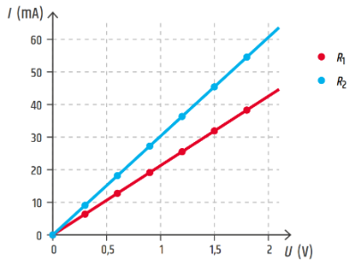

## Kirchhoffove zákony
### 1. Kirchhoffov zákon

- o prúdoch a uzloch
<table>
  <tr>
    <th>1. KZ pre uzol A</th>
    <th>1. KZ pre uzol B</th>
  </tr>
  <tr>
    <td>I1 = I2 + I3</td>
    <td>0 = I1 - I2 - I3</td>
  </tr>
  <tr>
    <td>I1 = I2 + I3</td>
    <td>0 = I2 + I3- I1</td>
  </tr>
</table>
        Súčet prúdov do uzla vtekajúcich sa rovná súčtu prúdu z uzla vytekajúcich (druhé znenie: algebrický súčet prúdov v uzle sa rovná nule)

### 2.Kirchhoffov zákon
- o napätiach a slučkách
<table>
      <tr>
        <td>V uzavretej slučke je súčet napätí rovné nule</td>
        <td>0 = UR1 + UR3 - U</td>
      </tr>
      <tr>
        <td>Súčet úbytkov napätí je rovné napätí na zdroji</th>
        <td>U = UR1 + UR3</td>
      </tr>
</table>

## Výpočet sériového, paralelného a kombinovaného zapojenia s rezistormi

### 1. Sériové zapojenie

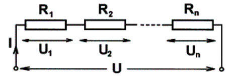

$U = U1 + U2 + U3$

$R*I = R1*I + R2*I + R3*I$

$R = R1 + R2 + R3$

**Dôležité:**
- V celej vetve je prúd rovnaký
- Výsledné napätie sa rovná súčtu napätí na jednotlivých odporoch
- Výsledný odpor sa rovná súčtu jednotlivých odporov
- Výsledný odpor je vždy väčší ako hociktorý z odporov
- Napätie sa rozdelí na jednotlivé odpory v priamom pomere k odporom

### 2. Paralelne zapojenie

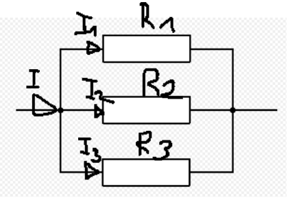

$I = I1 + I2 + I3$  

$\frac{U}{R} = \frac{U}{R_{1}} + \frac{U}{R_{2}} + \frac{U}{R_{3}}$

$\frac{1}{R} = \frac{1}{R_{1}} + \frac{1}{R_{2}} + \frac{1}{R_{3}}$

**Dôležité:**
- Na všetkých paralelných vetvách je rovnaké napätie
- Výsledný prúd sa rovná súčtu prúdov cez jednotlivé rezistory
- Prevrátená hodnota výsledného odporu sa rovná súčtu prevrátených hodnôt jednotlivých odporov
- Prúdy vo vetvách sa rozdelia v nepriamom pomere k odporom(cez väčší odpor menší prúd)
- Výsledný odpor je menší ako odpor ktorejkoľvek vetvy
- Keď je n rovnakých odporov R1 paralelne, tak R = R1/n

### 3. Sériovo paralelne

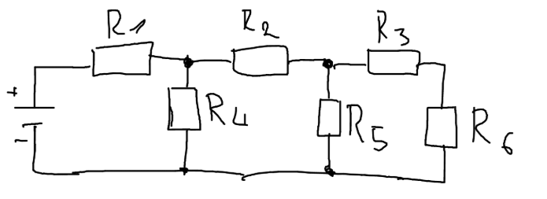

| $R_1$ | $R_2$ | $R_3$ | $R_4$ | $R_5$ | $R_6$ | 
|-------|-------|-------|-------|-------|-------|
|  10 Ω |   7 Ω |   2 Ω |  10 Ω |   6 Ω |   4 Ω |

|                        |  Výpočet  | Výsledok |
|------------------------|-----------|----------|
| **R₃₆** (Sériovo)      | $R_{36} = R_3 + R_6$ $R_{36} = 2 + 4$ | $R_{36} = 6 Ω$ |
| **R₃₅₆** (Paralerne)   | $R_{356} = \frac{R_5 × R_{36}}{R_5 + R_{36}}$ $R_{356} = \frac{6 × 6}{6 + 6}$ | $R_{356} = 3 Ω$ |
| **R₂₃₅₆** (Sériovo)    | $R_{2356} = R_2 + R_{356}$ $R_{2356} = 7 + 3$ | $R_{2356} = 10 Ω$ |
| **R₂₃₄₅₆** (Paralerne) | $R_{23456} = \frac{R_{2356} × R_4}{R_{2356} + R_4}$ $R_{23456} = \frac{10 × 10}{10 + 10}$ | $R_{23456} = 5 Ω$ |
| **R₁₋₆** (Dokopy)      | $R_{1-6} = R_1 + R_{23456}$ $R_{1-6} = 10 + 5$ | $R_{1-6} = 15 Ω$ |

## Rezistor, označenie a zhotovenie

__Potenciometer__ - nastaviteľný rezistor, prístupný pre zmenu(odporu) na zariadení(zvonu) -- otáčací gombík  

__Trimer__ - nastaviteľný rezistor, dostupný k zmene len dnu v zariadení(nedá sa zmeniť z vonku)  

**Označovanie rezistorov:**  
a) Farebný kód(prúžky) 
- Farebné prúžky na tele rezistoru  

b) Číselné označovanie 
- Čísla na tele rezistoru (4k5 = 4500Ω, 5M2 = 5 200 000Ω, 4R7 = 4,7Ω)  

**Zhotovenie rezistorov:**  
*Drôtové(vinuté)* -- drôt navinutý na keramické teliesko  
*Vrstvové* -- odporová vrstva sa nanesie(naparí) na (keramické)jadro (uhlíkový, metaloxidový)  
*Materiálové(SMD)* -- 2 vodivé plôšky  

**Typové rady(normy):**  
E6 -- tolerancia ± 20%  
E12 -- tolerancia ± 10%  
E24 -- tolerancia ± 5%  
$R = \rho*\frac{l}{S}$

## Výpočet C a L z fyzických rozmerov súčiastok
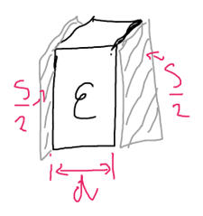

$$C = \varepsilon_{0} \cdot \varepsilon_{r} \cdot \frac{S}{d}$$

$C$ - kapacita ... $[F]$ farad   
$ε_0$ = permitivita vákua (8,854*10^-12^ F/m)  
$ε_r$ = relatívna permitivita materiálu  
S = plocha dosiek kondenzátora  
d = vzdialenosť medzi dielektrikami(priemer dielektrika)  

$$L = N² * μ * S / l$$

$L$ - indukcia ... $[H]$ henry   
N = počet závitov cievky  
μ(mí) = magnetická priepustnosť jadra (permeabilita prostredia H/m)  
S = prierez cievky  
l = dĺžka cievky  

## Elektrostatické(elektrické) a magnetické pole

### 1. Elektrostatické pole
Je to pole statických nábojov -- Q[C] C- coulomb(jednotka veličiny)  

[Coulombov zákon]{.underline} -- vyjadruje veľkosť akou na seba pôsobia 2 statické náboje Q1, Q2 v rôznom prostredí ε, vo vzdialenosti r  

$$F = \frac{1}{4\pi\varepsilon} \cdot \frac{Q_1 \cdot Q_2}{r^2}$$
$ε = ε_0 * ε_r$  
$Q_1, Q_2$ -> veľkosť nábojov  
r -> vzdialenosť medzi nábojmi  

#### Intenzita elektrostatického poľa

$$E = \frac{F}{Q}\ldots.\left\lbrack \frac{N}{C} \right\rbrack\ \ \ \ \ \ \ \ \ \ \ \ \ \ E = \frac{U}{d}\ldots\ldots.\left\lbrack \frac{V}{m} \right\rbrack$$

- Vektorová veličina -> má veľkosť, smer, pôsobisko
- Znázornenie intenzity -> siločiary  

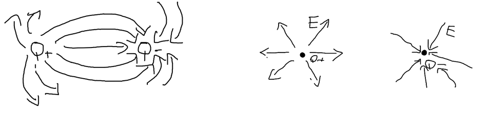

$E1 = \frac{1}{4\pi\varepsilon}\ .\frac{Q_1}{r_1}\ $  
$E2 = \frac{1}{4\pi\varepsilon}\ .\frac{Q_2}{r_2}\ $  
$E = E1 + E2$ - intenzita v danom mieste  

#### Elektrická indukcia

$$D = \frac{Q}{S}\ldots.\left\lbrack \frac{C}{m²} \right\rbrack$$

- Náboj, ktorý sa indukuje, nahromadí na jednotkovej ploche vodiča, vloženého do vonkajšieho elektrostatického poľa  
- Množstvo naindukovaného náboja závisí od polohy vodiča v poli  
- Ak je vodič otočený pod uhlom 90º → D= 0 → D = Q/S * cos α( cos 90 = 0)  

### 2. Magnetické pole
Jeho vznik spôsobuje pohyb elektrónov  
permanentný magnet -- pohybujúci sa elektrón, prúdovodič -- pohybujúci sa elektrón  
Druhy magnetických látok -- feromagnetické, diamagnetické, paramagnetické  

#### Magnetické napätie - *Um[A]*
Je vyvolávané prúdom  

Um pre jeden vodič → $Um = I$  
Um pre viac vodičov → $Um = I1 + I2 + ... In$  
Um pre cievku → Um = N * I (N- počet závitov cievky)  

#### Intenzita magnetického poľa - *H*  
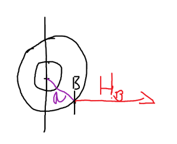

$H = \frac{Um}{l}\ldots.\left\lbrack \frac{A}{m} \right\rbrack$, $H = \frac{B}{µ}$  
$H_b = \frac{I}{2\pi*a}$  
- Dotyčnica k siločiare v smere siločiary  
- Intenzita v smere siločiary  

#### Magnetická indukcia - *B*  
$B = \frac{\varphi}{S}\ \ \ \ \ \ \ \ \ \ \ \ \ B = µ*H\ $ 

$\phi$(fí) - magnetický tok [Wb] .. Weber, je to tok cez plochu = počet siločiar  
S - plocha [$m^2$]  
B - indukcia [T] .. Tesla, hustota siločiar cez určitú plochu  
$\mu$(mí) - permeabilita magnetickej látky ($µ_0 = 4π * 10^{-7} H/m$)  

#### Vzťah medzi intenzitou a indukciou
**Hysterézna slučka**
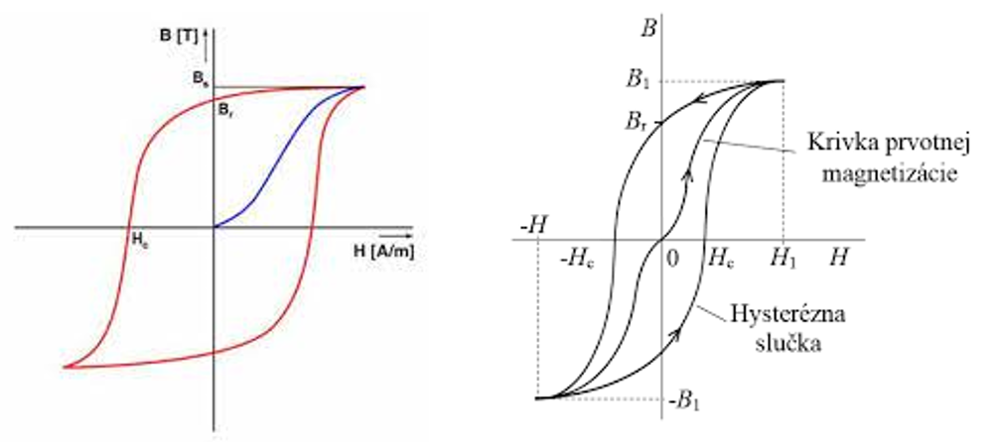
$H_C$ - koercitívna sila = hodnota vonkajšieho magnetického poľa, ktorým z látky odstránim zvyškový magnetizmus  
$B_r$ - remanentný (zvyškový) magnetizmus, je pri ňom vonkajšie pole = 0 (nepôsobí prúd)  
Čím je slučka väčšia, tým sa materiál ťažšie zmagnetizuje  

Magnetický tok Φ → $\Phi = \frac{Um}{Rm}$  
Magnetický odpor Rm → $Rm = \frac{Um}{\varphi}$  
$Rm = \frac{1}{\mu}*\ \frac{l}{S}$ Rm[H^-1^]  
Magnetická vodivosť Gm = $Gm = \frac{1}{Rm}\ \lbrack H\rbrack$  

### Porovnanie veličín elektrostatického a magnetického poľa
| | | |
| -------- | ------- | ------- |
| Elektrostatická Intenzita | <=> | Magnetická Intenzita | 
| Elektrická Indukcia       | <=> | Magnetická Indukcia  | 

## Vlastnosti R,L,C v striedavých obvodoch

### 1. R (Odpor)
- Napätie a prú sú vo fáze(ak I = 0, tak U = 0), φ(fí) = 0  
- Odpor je frekvenčne nezávislý  

$$u_{R} = U_{m} \cdot \sin\omega \cdot t$$  
$$i = I_{m} \cdot \sin\omega \cdot t$$  
$$R = \frac{u}{i}\ \ = \ \ \frac{Uef}{Ief}$$  
$u, i$ - okamžitá hodnota  
$I_m, U_m$ - maximálna hodnota  
$U_{ef}, I_{ef}$ - efektívna hodnota Ief = Imax / √2  
$\omega$(omega) - uhlová rýchlosť → Ѡ = 2 * π * f  
$t$ - čas  

### 2. L (Cievka)
- $u_L$ a i sú posunuté o 90º, u~L~ predbieha prúd(cievka posúva napätie o 90º dopredu)  
- napätie je Um vtedy, keď prúd je 0  
- $X_L$ je frekvenčne závislý, so stúpajúcou frekvenciou stúpa odpor  

$$u_{L} = U_{m} \cdot {sin(}\omega \cdot t + \ 90)$$  
$$i = I_{m} \cdot \sin\omega \cdot t$$  
$$X_L = \omega * L = 2 * π * f * L $$ 

$L$ - indukčnosť cievky  
$X_L$ - zdanlivý odpor cievky v striedavom obvode → indukčná reaktancia  

### 3. C (Kapacita)
- u a i sú posunuté o 90°, $i_C$ predbieha napätie (kondenzátor posúva prúd o 90° dopredu)  
- $XC$ je frekvenčne závislý, so stúpajúcou frekvenciou klesá odpor  

$$u = U_{m} \cdot {sin}\omega \cdot t$$  
$$i = I_{m} \cdot \sin{(\omega} \cdot t + \ 90{^\circ})$$  
$$X_{C} = \frac{1}{2\pi f \cdot C}$$  

$C$ - kapacita kondenzátora  
$X_L$ - zdanlivý odpor kondenzátora v striedavom obvode → kapacitná reaktancia
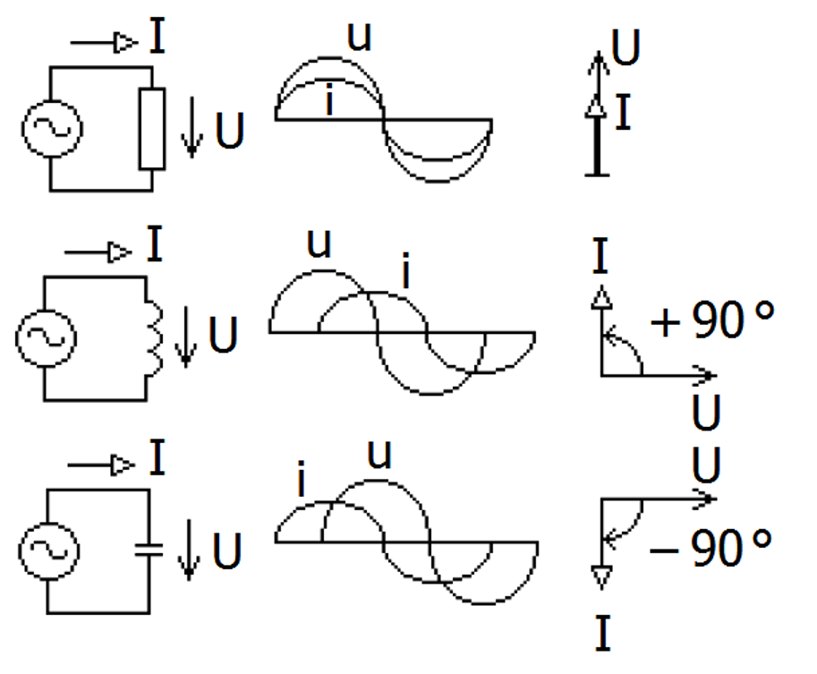  

## Rezonančné obvody (Z,Y,X cievky a kondenzátora)

### 1. Sériový RLC
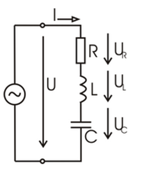  

$$u = u_R + u_L + u_C$$  
$$Z = \sqrt{R^{2} + \left( X_{L} - X_{C} \right)^{2}} [Ω] $$ 

Z - impedancia obvodu, odpor striedavého obvodu  
Indukčný charakter → $X_L > X_C$  
Kapacitný charakter → $X_C > X_L$  

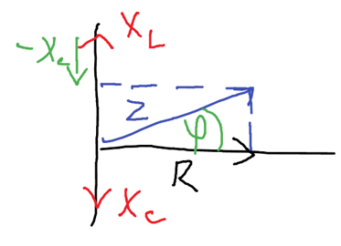

cos φ(fí) = $\frac{R}{Z}$  
sin φ(fí) = $\frac{XL\ - \ XC}{Z}$

__Stav rezonancie__  
$X_L = X_C$ → $Z = \sqrt{R^{2} + (0)^{2}}$ → $Z = \sqrt{R^{2}}$ → $Z = R$  
Rezonančná frekvencia → $f_{0} = \frac{1}{2\pi\sqrt{LC}}$  
V stave rezonancie je najvyšší prú a najnižší odpor  

### 2. **Paralelný RLC**  

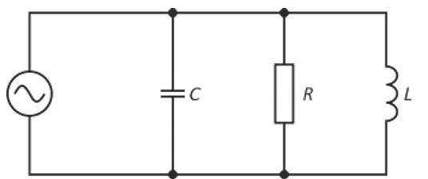

$$Y = \frac{1}{Z}$$  
Y - Admitancia [S]  

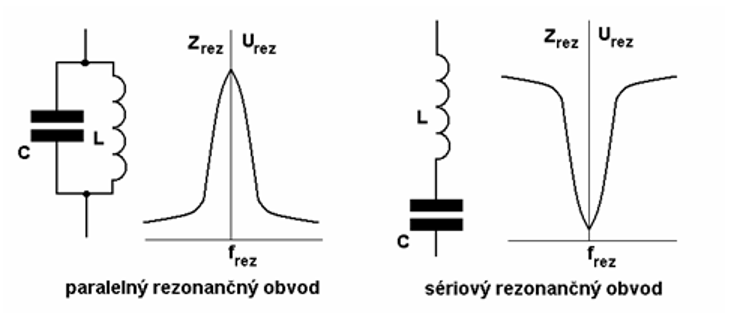

## Okamžitá, maximálna, efektívna hodnota striedavého U a I

### 1. Okamžitá  
Je to hodnota v konkrétnom čase  

$$u = U_{m} \cdot \sin\omega \cdot t$$  
$$i = I_{m} \cdot \sin\omega \cdot t$$  

$\omega$ (omega) - uhlová rýchlosť → $\omega = 2 * π * f$  
t → čas  
u , i → okamžitá hodnota  

### 2. Maximálna  
Je to najväčšia výchylka okamžitej hodnoty od 0 → najväčšia hodnota U, I  

$$U_{\max} = U_{ef} \cdot \sqrt{2}$$  
$$I_{\max} = I_{ef} \cdot \sqrt{2}$$  

### 3. Efektívna
Hodnota, ktorá má rovnaké tepelné účinky ako jednosmerný prúd  

$$U_{ef} = \frac{U_{\max}}{\sqrt{2}}$$  
$$I_{ef} = \frac{I_{\max}}{\sqrt{2}}$$  

# Polovodičové súčiastky
## Fyzikálna podstata polovodiča
Sú to materiály, ktoré majú vlastnosti medzi vodičmi a izolantmi. Sú to prvky z 4 skupiny periodickej tabuľky.  
**Princíp:** V čistom vstave má 4 elektróny na valenčnej vrstve, ktoré vytvárajú kovalentné väzby s atómami. Pri vyššej teplote alebo osvietení sa elektróny môžu z väzieb oddeliť. Voľné elektróny sa môžu pohybovať(vedia elektrický prúd), po ich oddelení vzniká dierka.  

## Vlastná a nevlastná vodivosť polovodiča typu P, N

### 1. Vlastná vodivosť
Polovodič bez prídavných atómov, vodivosť vzniká iba pôsobením tepla alebo svetla  
Pri uvoľnení elektrónu vzniká dierka, množstvo dier a elektrónov je rovnaké  

### 2. Nevlastná vodivosť  
Dosahuje sa dopovaním → pridaním malého množstva cudzích atómov, ktoré zmenia počet elektrónov  

### Polovodič typu N:  
Medzi atómy zo 4 skupiny je primiešaný prvok z 5 skupiny  
4 elektróny vytvoria väzbu a ostáva 1 elektrón naviac. Elektróny sú hlavné(majoritné) nosiče náboja a dierky minoritné  

### Polovodič typu P:
Medzi atómy zo 4 skupiny je primiešaný prvok z 3 skupiny  
Na vytvorenie väzby chýba 1 elektrón → vzniká dierka. Dierky sú hlavné nosiče náboja a elektróny minoritné  

## Polovodičová dióda -- funkcia, charakteristika

Je to elektronická súčiastka, ktorá prepúšťa prúd iba v jednom smere  

Tvorí ju PN priechod → je to spojenie polovodiču typu P a N, elektróny a dierky sa navzájom zrušia a vznikne oblasť bez voľných elektrónov(hradlová vrstva). Pri kladnom napätí prechádza prúd a pri zápornom neprechádza.  

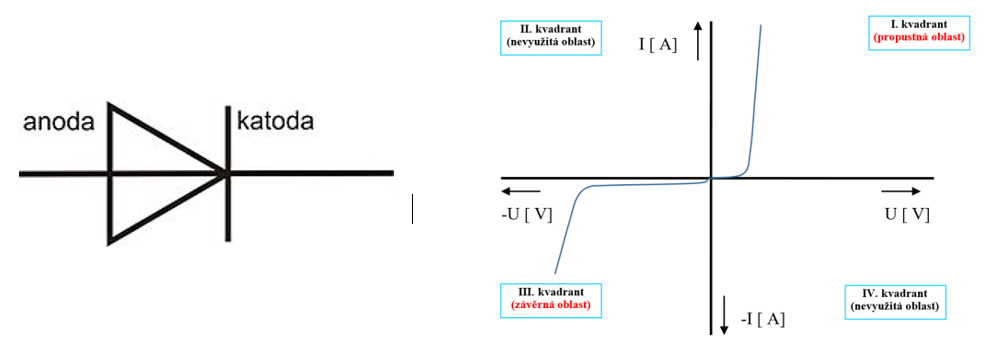

Môže byť zapojená v priepustnom a závernom smere  

### Priepustný: 
Anóda je pripojená na kladný pól a katóda na záporný  
Prúd začne výrazne tiecť po prekročení prahového napätie(0,7V pre kremík)  

### Záverný:  
Anóda je pripojená na záporný pól a katóda na kladný  
Prúd netečie. Pri príliš veľkom napätí vie dôjsť k prerazeniu diódy a jej poškodeniu  

**Použitie diódy**: usmerňovače, stabilizátory  

## Špeciálne diódy, Zenerová dióda, Varikap

### 1. Zenerová dióda
Zapája sa v závernom smere, pri určitom napätí(zenerové napätie) začne viesť prúd v závernom smere bez zničenia. V priepustnom smere sa správa ako klasická dióda  
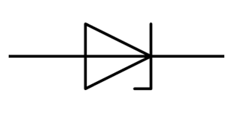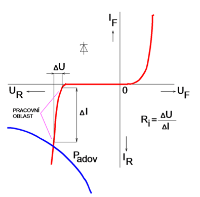  

Využíva sa na stabilizáciu napätia a aj ako ochrana pred prepätím  

### 2. Varikap  
Mení svoju kapacitu v závislosti od napätia v závernej polarizácií. Pri závernom napätí sa zväčší PN priechod a tým sa mení kapacita → čím väčšie U tým je menšia kapacita.  

Využíva sa v laditeľných rádiových obvodoch, mobiloch, televízoroch  
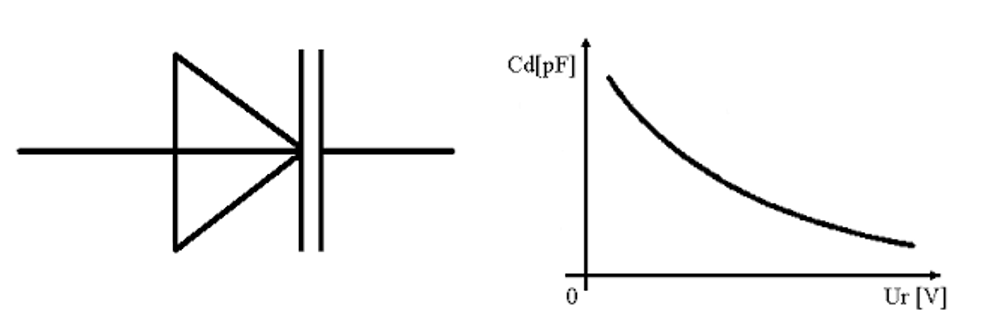 

## Tranzistory 
- bipolárne, unipolárne, porovnanie, značka, VACH, hybridné parametre
Delíme ich na:  
- Bipolárne → PNP, NPN  
- Unipolárne → FET, JFET, MISFET, MOSFET  

Je to aktívny zosilňovací prvok, zložený z polovodičov, PN priechody  

Použitie: zosilňovač, spínač  

### 1. Bipolárne  
Tranzistor skladá sa z 2 PN priechodov(3 polovodiče), ktoré musia byť polarizované:  
- Emitor, báza v priepustnom smere  
- Kolektor, báza v závernom smere  

Malým bázovým prúdom ovplyvňujeme(regulujeme) veľký prúd na emitore  
Na vedení prúdu sa využívajú obidva druhy nosičov náboja(elektróny, dierky)  

NPN - hlavným nosičom náboja sú elektróny  
PNP - hlavným nosičom náboja sú dierky  

Použitie - zosilňovač(externé napájanie), spínač, logické funkcie -- 0, 1  
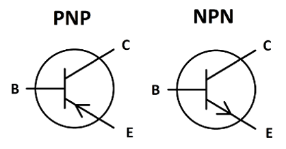 
 

#### Zapojenia:
   1. Spoločný Emitor  
      - Malý vstupný odpor, relatívne veľký výstupný odpor  
      - Veľké prúdové, napäťové, výkonové zosilnenie  
   2. Spoločný kolektor(emitorový sledovač)  
      - Veľký vstupný odpor, malý výstupný  
      - Malé napäťové, výkonové zosilnenie, veľké prúdové zosilnenie  
   3. Spoločná báza  
      - Malý vstupný odpor, veľký výstupný odpor  
      - Použitie na reguláciu napätia  

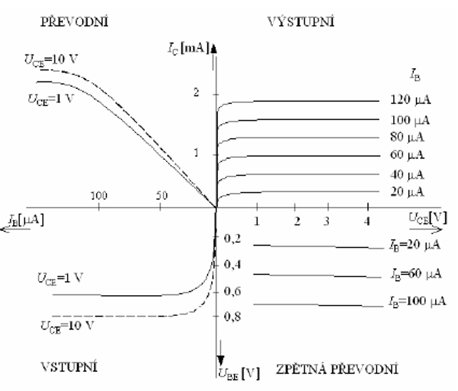

#### Hybridné parametre:  
$H_{11} = ΔU_{BE} / ΔI_{BE}$ - vstupný dynamický odpor  
$H_{21} = ΔI_{C} / ΔI_{B}$ - prúdový zosilňovací činiteľ  
$H_{12} = ΔU_{BE} / ΔU_{CE}$ - napäťové zosilnenie v spätnom smere  
$H_{22} = ΔI_{C} / ΔU_{CE}$ - výstupná vodivosť  

### 2. Unipolárne ([link](https://www.kis.fri.uniza.sk/~ludo/e-Publikacia/elektronika/kap3/index.html))  
Na vedení prúdu sa zúčastňujú iba nosiče náboja jednej polarity( dierky alebo elektróny)  
Má Kolektor, Emitor, Gate  

FET = field efect tranzistor (pólom riadený tranzistor)  

#### 1. JFET  
JFET -- junction FET  

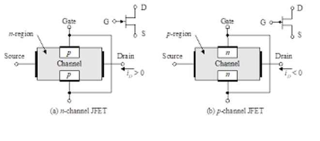  
Princíp funkčnosti: medzi hradlom a kanálom je vytvorený PN priechod, ktorý sa polarizuje v závernom smere  
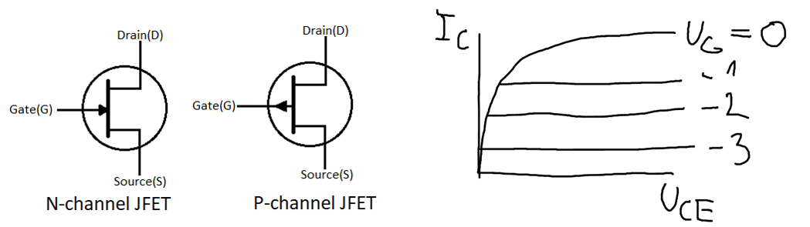

#### 2. MISFET 
MISFET -- metal insulator semiconductor FET  

#### 3. MOSFET  
Zo zabudovaným kanálom: 
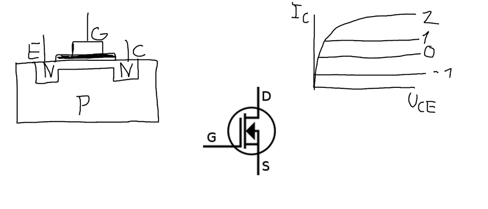

S indukovaným kanálom:  
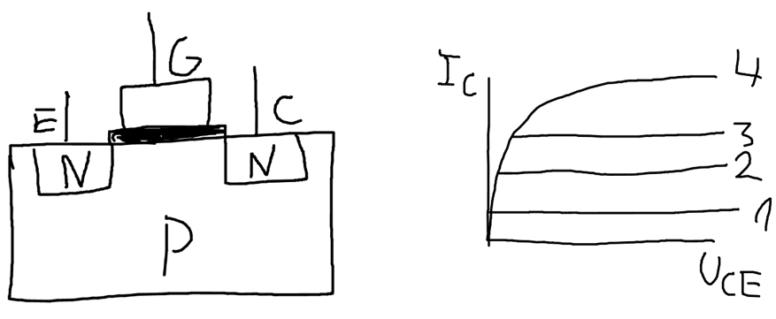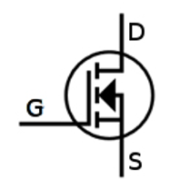

{width="1.4064457567804025in" height="1.5002088801399824in"}  

#### _Porovnanie_
| Bipolárne                           |   <=>   | Unipolárne                              | 
| ----------------------------------- | ------- | --------------------------------------- |
| prúdovo riadený(báza)               |         | riadené napätím(gate)                   | 
| elektróny aj dierky(vedenie Q)      |         | buď elektróny alebo dierky(vedenie Q)   | 
| pomalší, viac sa zahrieva           |         | rýchlejší, menšie zahrievanie           | 
| odolnejší proti statickej elektrine |         | citlivý na statickú elektrinu           | 

# Číslicová technika
## Kombinačné a sekvenčné obvody, porovnanie
### 1. Kombinačné Logické obvody(KLO)
Sú také logické obvody, ktorých stav výstupov je jednoznačne daný stavom ich aktuálnych vstupov, teda v každom čase je možné priradiť akékoľvek kombinácie vstupov vždy tú istú príslušnú kombináciu výstupov.  

_ozdelenie KLO:_  
   1. **Jednoduché KLO** - hradlá  
   Slúžia na realizáciu základných logických operácií → NOT, AND, NAND, OR, NOR, XOR, XNOR, AND OR INVERT  
   2. **Zložité KLO** - aritmetické jednotky  
   Slúžia na realizáciu zložitých aritmetických logických operácií → sčítačka, násobička, mutiplexor, demultiplexor, prepínač, komparátor, kóder, dekóder, generátor parity, aritmeticko-logická jednotka  

### 2. Sekvenčné Logické obvody(SLO)  
Ich vstupné premenné sú určené nie len kombináciou hodnôt v danom okamihu ale aj minulými hodnotami niektorých premenných, z toho vyplýva, že SLO si musí pamätať hodnoty z predchádzajúceho stavu, čo znamená, že musí mať pamäť.  

Základom SO sú klopné obvody, z ktorých sa konštrujú ďalej tzv. čítače, registre, pamäťové obvody  

Máme preklápacie obvody → RS, SL, D, JK, T  
Zložitejšie → Čítače, pamäťové registre  

**Porovnanie:**  
| KLO                    |   <=>   | SLO                             | 
| ---------------------- | ------- | ------------------------------- |
| Nemá pamäť             |         | Má pamäť                        | 
| Bez synchronizácie     |         | Synchronizácia -- clock rate    |
| Okamžitá odozva        |         | Oneskorená odozva               |
| Výstup podľakt. hodnôt |         |  Výstup akt hodnoty + predchádzajúce |

## Logické obvody

### Hradlo AND (logický súčin A*B)
Jeho výstup je logickým súčinom všetkých jeho vstupov  
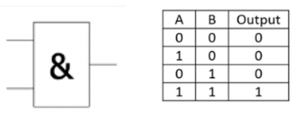

### Hradlo OR (logický súčet A+B)
Jeho výstupom je súčet všetkých jeho vstupov  
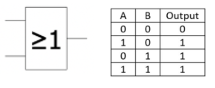

### Hradlo NOT (negácia)
Jeho výstup je negáciou jeho vstupu, nazýva sa logický invertor  
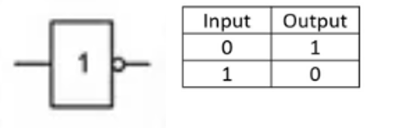

### Hradlo NAND (negovaný logický súčin) 
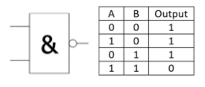

### Hradlo NOR (negovaný logický súčet)
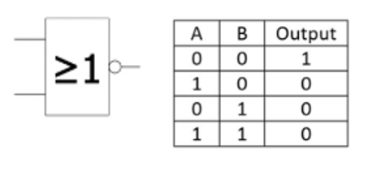

---

--- TUNING END --- 

---