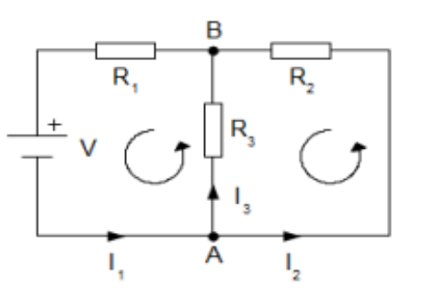

<div align="center">
    <div align="left">
        <a href="/README.md">Domov</a>
    </div>
    <div align="right">
        <a href="../OKRUHY.md#Elektrotechnické-predmety">Okruhy</a>
        |
        <a href="https://drive.google.com/drive/folders/19tTK_VX4YhtX3FrV0fOEyaj6VtMqGik6?usp=sharing">Materály</a>
    </div>

# Elektronika
</div>


<div style="display: flex; justify-content: space-between;">
    <span style="font-size: 20px;">
        <a href= "/TCOZ/ELK/ELS/ELEKTOTECHICKA_SPOSOBILOST.md">
            
        </a>
        Elektrotechnická Spôsobilosť
    </span>
    <span><a href= "/TCOZ/ELK/ELS/ELEKTOTECHICKA_SPOSOBILOST.md">[ELS]</a></span>
</div>

# Jednosmerné a striedavé obvody

## Ohmov zákon, Kirchhoffové zákony
```
U=R×I
```
Ak lineárnym rezistorom s odporom R preteká prúd I vytvorí sa na jeho svorkách úbytok napätia U
```
R=U/I
```
Podiel napätia a prúdu je veličina stála a nazýva sa elektrický odpor
```
I=U/R
```
Prúd, ktorý preteká lineárnym rezistorom je priamo úmerný napätiu na jeho svorkách a nepriamo úmerný jeho veľkosti

**VACH(volt ampérová charakteristika)** -  grafické znázornenie ohmovho zákona


### Kirchhoffove zákony
<ol>
    <li>
        <b>Kirchhoffov zákon</b><i> – o prúdoch a uzloch</i><br>
        
        <table>
          <tr>
            <th>1. KZ pre uzol A</th>
            <th>1. KZ pre uzol B</th>
          </tr>
          <tr>
            <td>I<sub>1</sub> = I<sub>2</sub> + I</sub>3</td>
            <td>0 = I<sub>1</sub> - I<sub>2</sub> - I<sub>3</sub></td>
          </tr>
          <tr>
            <td>I<sub>1</sub> = I<sub>2</sub> + I<sub>3</sub></td>
            <td>0 = I<sub>2</sub> + I<sub>3</sub>- I<sub>1</sub></td>
          </tr>
        </table>
        <p>Súčet prúdov do uzla vtekajúcich sa rovná súčtu prúdu z uzla vytekajúcich (druhé znenie: algebrický súčet prúdov v uzle sa rovná nule)</p>
    </li><li>
        <b>Kirchhoffov zákon</b><i> – o napätiach a slučkách</i><br>
        
        <table>
          <tr>
            <th>V uzavretej slučke je súčet napätí rovné nule</th>
            <th>Súčet úbytkov napätí je rovné napätí na zdroji</th>
          </tr>
          <tr>
            <td>U<sub>R1</sub> + U<sub>R3</sub> - U = 0</td>
            <td>U = U<sub>R1</sub> + U<sub>R3</sub></td>
          </tr>
        </table>
    </li>
</ol>

## Výpočet sériového, paralelného a kombinovaného zapojenia s rezistormi 
<ol>
    <li>
        <b>Sériové zapojenie</b><br>
        
        <p>U = U<sub>1</sub> + U<sub>2</sub> + U<sub>3</sub></p>
        <p>R * I = R<sub>1</sub> * I + R<sub>2</sub> * I + R<sub>3</sub> *I</p>
        <p>R = R<sub>1</sub> + R<sub>2</sub> + R<sub>3</sub></p>
        <i>Dôležité: </i>
        <ul>
            <li>
                V celej vetve je prúd rovnaký
            </li><li>
                Výsledné napätie sa rovná súčtu napätí na jednotlivých odporoch
            </li><li>
                Výsledný odpor sa rovná súčtu jednotlivých odporov
            </li><li>
                Výsledný odpor je vždy väčší ako hociktorý z odporov
            </li><li>
                Napätie sa rozdelí na jednotlivé odpory v priamom pomere k odporom
            </li>
        </ul>
    </li><li>
        <b>Paralelne zapojenie</b><br>
        
        <p>I = I<sub>1</sub> + I<sub>2</sub> + I<sub>3</sub></p>
        <p>U / R = U / R<sub>1</sub> + U / R<sub>2</sub> + U / R<sub>3</sub></p>
        <p>1/R = 1/R<sub>1</sub> + 1/R<sub>2</sub> + 1/R<sub>3</sub></p>
        <i>Dôležité: </i>
        <ul>
            <li>
                Na všetkých paralelných vetvách je rovnaké napätie
            </li><li>
                Výsledný prúd sa rovná súčtu prúdov cez jednotlivé rezistory
            </li><li>
                Prevrátená hodnota výsledného odporu sa rovná súčtu prevrátených hodnôt jednotlivých odporov
            </li><li>
                Prúdy vo vetvách sa rozdelia v nepriamom pomere k odporom(cez väčší odpor menší prúd)
            </li><li>
                Výsledný odpor je menší ako odpor ktorejkoľvek vetvy
            </li><li>
                Keď je n rovnakých odporov R1 paralelne , tak  R = R1/n
            </li>
        </ul>
    </li><li>
        <b>Sériovo paralelné zapojenie</b><br>
        
        <table>
          <tr>
            <th>R<sub>1</sub></th>
            <th>R<sub>2</sub></th>
            <th>R<sub>3</sub></th>
            <th>R<sub>4</sub></th>
            <th>R<sub>5</sub></th>
            <th>R<sub>6</sub></th>
          </tr>
          <tr>
            <td>10 Ω</td>
            <td> 7 Ω</td>
            <td> 2 Ω</td>
            <td>10 Ω</td>
            <td> 6 Ω</td>
            <td> 4 Ω</td>
          </tr>
        </table>
        <table>
          <tr>
            <td>
                <p>R<sub>36</sub> = R<sub>3</sub> + R<sub>6</sub></p>
                <p>R<sub>36</sub> = 2 + 4</p>
                <p>R<sub>36</sub> = 6 Ω</p>
            </td><td>
                <p>R<sub>356</sub> = R<sub>5</sub>*R<sub>36</sub> / R<sub>5</sub>+R<sub>36</sub></p>
                <p>R<sub>356</sub> = 6*6 / 6+6</p>
                <p>R<sub>356</sub> = 3 Ω</p>
            </td><td>
                <p>R<sub>2356</sub> = R<sub>2</sub> + R<sub>356</sub></p>
                <p>R<sub>2356</sub> = 7 + 3</p>
                <p>R<sub>2356</sub> = 10 Ω</p>
            </td>
          </tr>
          <tr>
            <td>
                <p>R<sub>2356</sub> = 7 + 3</p>
                <p>R<sub>2356</sub> = 10 Ω</p>
            </td><td>
                <p>R<sub>23456</sub> = R<sub>2356</sub> * R<sub>4</sub> / R<sub>2356</sub> + R<sub>4</sub></p>
                <p>R<sub>23456</sub> = 10*10 / 10+10</p>
                <p>R<sub>23456</sub> = 10 Ω</p>
            </td><td>
                <p>R<sub>1-6</sub> = R<sub>1</sub> + R<sub>23456</sub></p>
                <p>R<sub>1-6</sub> = 10 + 5</p>
                <p>R<sub>1-6</sub> = 15 Ω</p>
            </td>
          </tr>
        </table>
    </li>
</ol>

## Rezistor, označenie a zhotovenie


**Potenciometer** – nastaviteľný rezistor, prístupný pre zmenu(odporu)  na zariadení(zvonu) – otáčací gombík

**Trimer** – nastaviteľný rezistor, dostupný k zmene len dnu v zariadení(nedá sa zmeniť z vonku)
### Označovanie rezistorov: 
<ol>
    <li>
        Farebný kód(prúžky) <br>
        - Farebné prúžky na tele rezistoru
    </li><li>
        Číselné označovanie <br>
        - Čísla na tele rezistoru( 4k5 = 4500Ω, 5M2 = 5 200 000Ω, 4R7 = 4,7Ω) 
    </li>
</ol>

### Zhotovenie rezistorov: 
**Drôtové(vinuté)** – drôt navinutý na keramické teliesko<br>
**Vrstvové** – odporová vrstva sa nanesie(naparí) na (keramické)jadro (uhlíkový, metaloxidový)<br>
**Materiálové(SMD)** – 2 vodivé plôšky

### Typové rady(normy):
<ul type=none>
    <li>
        E6 – tolerancia ± 20%
    </li><li>
        E12 – tolerancia ± 10%
    </li><li>
        E24 – tolerancia ± 5%
    </li><li>
        R = ρ * l/S
    </li>
</ul>

### Výpočet C a L z fyzických rozmerov súčiastok
C = ε<sub>0</sub> × ε<sub>r</sub> S/d [F] <br>
<ul type=none>
    <li>
        ε<sub>0</sub> = permitivita vákua (8,854*10-12 F/m) 
    </li><li>
        ε<sub>r</sub>= relatívna permitivita materiálu
    </li><li>
        S = plocha dosiek kondenzátora
    </li><li>
        d = vzdialenosť medzi dielektrikami(priemer dielektrika)
    </li>
</ul>

L = N² * μ * S / l      [H]<br>
<ul type=none>
    <li>
        N = počet závitov cievky
    </li><li>
        μ(mí) = magnetická priepustnosť jadra (permeabilita prostredia H/m)
    </li><li>
        S = prierez cievky
    </li><li>
        l =  dĺžka cievky
    </li>
</ul>

