

    

        <a href="/README.md">Domov</a>
        >
        <a href="./PROGRAMOVANIE.md">PRO</a>
    

    

        <a href="../OKRUHY.md#programovanie">Okruhy</a>
        |
        <a href="https://drive.google.com/drive/folders/1-R0QweppWve7l7rt23FboOdxdV9U58OT?usp=sharing">Materály</a>
    

# UML

## Staticke Diagramy
<ul>
    <li>
        <b>Tried </b>
        <ul>
            <li>
                Modifikátory prístupu
                <ul type=none>
                    <li>
                        - súkromný člen (private)
                    </li><li>
                        + verejný člen (public)
                    </li><li>
                        # chránený člen (protected)
                    </li><li>
                        ~ člen viditeľný v rámci balíka (menného priestoru)
                    </li>
                </ul>
                 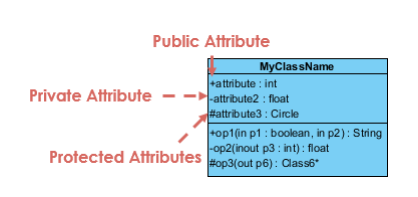
            </li><li>
                Realizácia - medzi rozhraním a triedou
                 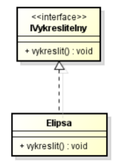
            </li><li>
                Asociačná trieda - medzi 2 entitami, môžeme rozšíriť o ďalšie atribúty
                 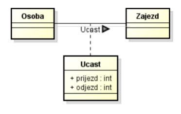
            </li>
        </ul>
        <i>Domenovy model</i>
        <ul>
            <li>
                Asociácia - entity <B>nezávisle</B> na sebe vzájomne na seba odkazujú
                 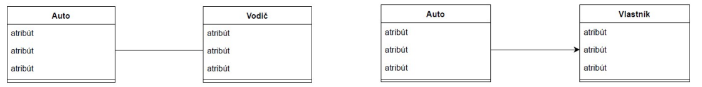
            </li><li>
                Agregácia - vzťah typu celok a časť  
                - časť môže existovať sama o sebe a byť súčasťou aj iných kolekcií
                 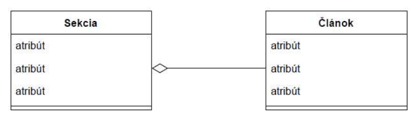
            </li><li>
                Kompozícia -  silnejšia agregacia
                - ak zanikne celok, zanikajú automaticky i jeho časti
                 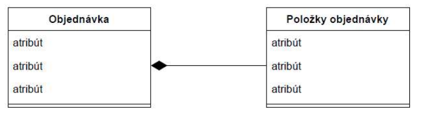
            </li><li>
                Generalizácia - jedná o dedičnosť 
                - Odvodená entita dedí vlastnosti a funkcionality hlavnej entity
                 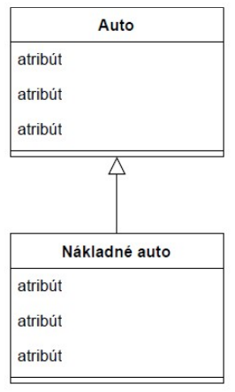
            </li><li>
                Multiplicita (Násobnosť) - môže byť uvedená u väzieb 
                1 - označuje konkrétnu hodnotu (práve 1) 
                * - označuje ľubovoľný počet vrátane 0 
                1 .. * (interval) – označenie intervalu
            </LI>
        </ul>
    </li>
    <li><b>Komponent</b></li>
    <li><b>Nasadenia</b></li>
</ul>

## Dynamicke Diagramy
<ul>
    <li><i>Objektov</i></li>
    <li><i>Use Casov</i> (pripadov uzitia)</li>
        <ul>
            <li>Relacie
                <ul>
                    <li>
                        Generalization (zovšeobecnenie) -  medzi aktérmi a prípadmi použiti
                         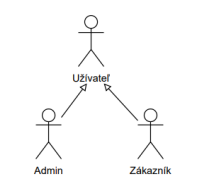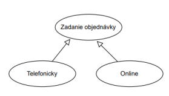
                    </li><li>
                        Include 
                         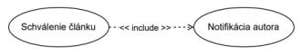
                    </li><li>
                        Extened
                         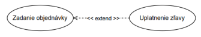
                    </li>
                </ul>
            </li>
        </ul>
    <li><i>Sekvencne</i></li>
    <li><i>Spoluprace</i></li>
    <li><i>Stavov</i></li>
    <li>
        <i>Aktivit</i>
        <ul>
            <li>
                Zahájenie a ukončenie (počiatočný a koncový uzol)
            </li><li>
                Akcia (aktivita)
            </li><li>
                Tok (prechod)
            </li><li>
                Rozhodnutie, zlúčenie
            </li><li>
                Vetvenie a spojenie
            </li><li>
                Oddelenie aktivít (plavecké dráhy)
            </li>
        </ul>
    </li>
</ul>

## Definovanie požiadaviek:
- Funkčné požiadavky    - Určujú, aké funkcionality bude systém poskytovať
 PR: Bankomat overí validitu vloženej platobnej karty.

- Nefunkčné požiadavky  - Vlastnosti alebo obmedzujúce podmienky daného systému
 PR: Riadiaci systém overí validitu karty do 3 sekúnd.